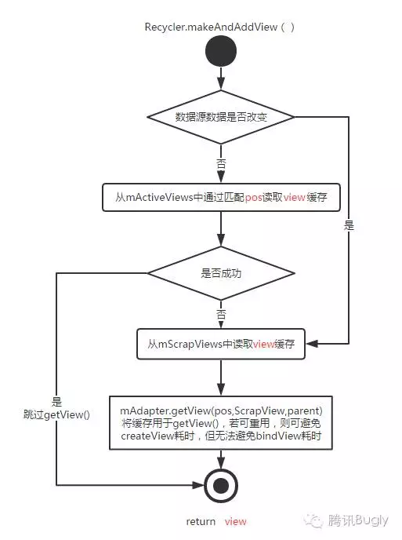

# RecyclerView 的缓存机制

## 预备知识

RecyclerView 本身是一个 ViewGroup，在滑动时会涉及到对子 View 的添加和移除（具体是通过 `RecyclerView#Adapter` 的 `onCreateView()` 进行创建 。为了提高性能，就需要对子 View 进行缓存。具体来说，RecyclerView 通过其内部类 `Recycler` 进行缓存的管理。这个类缓存了 `ViewHolder`（其内部包含了该 RecyclerView 的子 View）。这样就能在滑动时复用子 View 甚至其绑定的数据。**本质上缓存是为了减少重复绘制 View 和绑定数据的时间，从而提高了滑动时的性能**。

## 四级缓存

`Recycler` 中共有四级缓存，它们的优先级从高到低依次为：

| 缓存层级 | 涉及对象              | 作用                                                         | 重新创建视图 View<br />(`onCreateViewHolder()`) | 重新绑定数据<br />(`onBindViewHolder()`) | 生命周期                                                     |
| :------- | :-------------------- | :----------------------------------------------------------- | :---------------------------------------------- | :--------------------------------------- | ------------------------------------------------------------ |
| 一级缓存 | `mAttachedScrap`      | 缓存屏幕中可见范围的 `ViewHolder`                            | 否                                              | 否                                       | `onLayout()` 内                                              |
| 二级缓存 | `mCachedViews`        | 缓存滑动时即将与 RecyclerView 分离的 `ViewHolder`，按子 View 的 `position` 或 `id` 缓存，默认最多存放 2 个 | 否                                              | 否                                       | 与 `mAdapter` 一致，当 `mAdapter` 被更换时, `mCacheViews` 即被缓存至 `mRecyclerPool` |
| 三级缓存 | `mViewCacheExtension` | 开发者自行实现的缓存                                         | -                                               | -                                        |                                                              |
| 四级缓存 | `mRecyclerPool`       | `ViewHolder` 缓存池，本质上是一个 `SparseArray`，其中 `key` 是 `ViewType`（`int` 类型），`value` 存放的是 `ArrayList< ViewHolder>`，默认每个 `ArrayList` 中最多存放 5 个 `ViewHolder` | 否                                              | 是                                       | 与 RecyclerView 一致，当不再被引用释放                       |

一、二、四级缓存对象实际上都是 `ArrayList`，加入缓存也就是调用 `ArrayList#add()`，复用缓存则是 `ArrayList#remove()`。为什么不用 `ArrayList#get()` 呢？因为缓存被取出用于展示，已经不再是之前的“缓存状态”了，自然应该被移除。

这四级缓存的访问时机如下图：


RecyclerView 滑动时会触发 `onTouchEvent#onMove()`，从这里开始对 `ViewHolder` 的回收和复用。平常使用 RecyclerView 的时候需要设置 `LayoutManager`， 后者会负责前者的布局，包括 `ItemView` 的获取和复用。以 `LinearLayoutManager` 为例，RecyclerView 重新布局时会依调用以下方法：

- `onLayoutChildren()`：RecyclerView 布局的入口
- `fill()`：对剩余空间进行填充，这个方法会继续调用 `layoutChunk()`
- `layoutChunk()`：负责填充 View。用来填充的合适 View 最终通过在缓存类 `Recycler`中找到的

整个调用链是：`onLayoutChildren() -> fill() -> layoutChunk() -> next() -> getViewForPosition()`。最后的 `getViewForPosition()` 即是用来获取合适的 View 的。下面开始逐步分析。

### RecyclerView 填充 `ItemView` 的流程

```java
// LinearLayoutManager.java
@Override
public void onLayoutChildren(RecyclerView.Recycler recycler, RecyclerView.State state) {
    // layout algorithm:
    // 1) by checking children and other variables, find an anchor coordinate and an anchor
    //  item position.
    // 2) fill towards start, stacking from bottom
    // 3) fill towards end, stacking from top
    // 4) scroll to fulfill requirements like stack from bottom.
    // create layout state
    // ...
    if (mAnchorInfo.mLayoutFromEnd) {
        // fill towards start
        updateLayoutStateToFillStart(mAnchorInfo);
        mLayoutState.mExtraFillSpace = extraForStart;
        fill(recycler, mLayoutState, state, false); // <- 调用 fill
        startOffset = mLayoutState.mOffset;
        final int firstElement = mLayoutState.mCurrentPosition;
        if (mLayoutState.mAvailable > 0) {
            extraForEnd += mLayoutState.mAvailable;
        }
        // fill towards end
        updateLayoutStateToFillEnd(mAnchorInfo);
        mLayoutState.mExtraFillSpace = extraForEnd;
        mLayoutState.mCurrentPosition += mLayoutState.mItemDirection;
        fill(recycler, mLayoutState, state, false); // <- 调用 fill
        endOffset = mLayoutState.mOffset;

        if (mLayoutState.mAvailable > 0) {
            // end could not consume all. add more items towards start
            extraForStart = mLayoutState.mAvailable;
            updateLayoutStateToFillStart(firstElement, startOffset);
            mLayoutState.mExtraFillSpace = extraForStart;
            fill(recycler, mLayoutState, state, false); // <- 调用 fill
            startOffset = mLayoutState.mOffset;
        }
    } else {
        // fill towards end
        updateLayoutStateToFillEnd(mAnchorInfo);
        mLayoutState.mExtraFillSpace = extraForEnd;
        fill(recycler, mLayoutState, state, false); // <- 调用 fill
        endOffset = mLayoutState.mOffset;
        final int lastElement = mLayoutState.mCurrentPosition;
        if (mLayoutState.mAvailable > 0) {
            extraForStart += mLayoutState.mAvailable;
        }
        // fill towards start
        updateLayoutStateToFillStart(mAnchorInfo);
        mLayoutState.mExtraFillSpace = extraForStart;
        mLayoutState.mCurrentPosition += mLayoutState.mItemDirection;
        fill(recycler, mLayoutState, state, false); // <- 调用 fill
        startOffset = mLayoutState.mOffset;

        if (mLayoutState.mAvailable > 0) {
            extraForEnd = mLayoutState.mAvailable;
            // start could not consume all it should. add more items towards end
            updateLayoutStateToFillEnd(lastElement, endOffset);
            mLayoutState.mExtraFillSpace = extraForEnd;
            fill(recycler, mLayoutState, state, false); // <- 调用 fill
            endOffset = mLayoutState.mOffset;
        }
    }

    // ...
}
```

`LinearLayoutManager` 通过执行 `onLayoutChildren()` 开始对其子 View 的布局过程。在这个方法里会进一步去调用 `fill()` 方法。

```java
// LinearLayoutManager.java
/**
 * The magic functions :). Fills the given layout, defined by the layoutState. This is fairly
 * independent from the rest of the {@link LinearLayoutManager}
 * and with little change, can be made publicly available as a helper class.
 *
 * @param recycler        当前绑定 (attached) 到 RecyclerView 的 recycler
 * @param layoutState     指定如何填充可用空间
 * @param state           RecyclerView 传入的上下文 (context)，用于控制滚动步长
 * @param stopOnFocusable 为 true 时将会在遇到第一个可聚焦 (focusable) 的子 View 时停止填充
 * @return Number of pixels that it added. Useful for scroll functions.
 */
int fill(RecyclerView.Recycler recycler, LayoutState layoutState,
        RecyclerView.State state, boolean stopOnFocusable) {
    // max offset we should set is mFastScroll + available
    // 填充起始位置
    final int start = layoutState.mAvailable;
    if (layoutState.mScrollingOffset != LayoutState.SCROLLING_OFFSET_NaN) {
        // TODO ugly bug fix. should not happen
        if (layoutState.mAvailable < 0) {
            layoutState.mScrollingOffset += layoutState.mAvailable;
        }
        // 有滚动就执行一次 recycle
        recycleByLayoutState(recycler, layoutState);
    }
    // 计算剩余可用的填充空间
    int remainingSpace = layoutState.mAvailable + layoutState.mExtraFillSpace;
    // 记录每次循环中的填充结果
    LayoutChunkResult layoutChunkResult = mLayoutChunkResult;
    while ((layoutState.mInfinite || remainingSpace > 0) && layoutState.hasMore(state)) {
        // 屏幕还有剩余可用空间并且还有数据就继续执行
        layoutChunkResult.resetInternal();
        if (RecyclerView.VERBOSE_TRACING) {
            TraceCompat.beginSection("LLM LayoutChunk");
        }
        layoutChunk(recycler, state, layoutState, layoutChunkResult);
        if (RecyclerView.VERBOSE_TRACING) {
            TraceCompat.endSection();
        }
        if (layoutChunkResult.mFinished) {
            break;
        }
        layoutState.mOffset += layoutChunkResult.mConsumed * layoutState.mLayoutDirection;
        /**
         * Consume the available space if:
         * * layoutChunk did not request to be ignored
         * * OR we are laying out scrap children
         * * OR we are not doing pre-layout
         */
        if (!layoutChunkResult.mIgnoreConsumed || layoutState.mScrapList != null
                || !state.isPreLayout()) {
            layoutState.mAvailable -= layoutChunkResult.mConsumed;
            // we keep a separate remaining space because mAvailable is important for recycling
            remainingSpace -= layoutChunkResult.mConsumed;
        }

        if (layoutState.mScrollingOffset != LayoutState.SCROLLING_OFFSET_NaN) {
            layoutState.mScrollingOffset += layoutChunkResult.mConsumed;
            if (layoutState.mAvailable < 0) {
                layoutState.mScrollingOffset += layoutState.mAvailable;
            }
            recycleByLayoutState(recycler, layoutState);
        }
        if (stopOnFocusable && layoutChunkResult.mFocusable) {
            break;
        }
    }
    if (DEBUG) {
        validateChildOrder();
    }
    // 填充完成后修改起始位置
    return start - layoutState.mAvailable;
}
```

`fill()` 控制了应当如何填充 `ItemView`，内部通过循环来进行填充。在循环中进一步去调用 `layoutChunk()` 方法，这个是填充 `ItemView` 的核心方法，每执行一次就将一个 `ItemView` 填充到屏幕。

```java
// LinearLayoutManager.java
void layoutChunk(RecyclerView.Recycler recycler, RecyclerView.State state,
        LayoutState layoutState, LayoutChunkResult result) {
    // 1. 从一二级缓存中取得一个 ItemView 或直接创建一个 ItemView 用于填充
    // 这里的 next() 会继续调用 getViewForPosition()
    View view = layoutState.next(recycler);
    if (view == null) {
        if (DEBUG && layoutState.mScrapList == null) {
            throw new RuntimeException("received null view when unexpected");
        }
        // if we are laying out views in scrap, this may return null which means there is
        // no more items to layout.
        result.mFinished = true;
        return;
    }
    // 2. 添加 ItemView
    RecyclerView.LayoutParams params = (RecyclerView.LayoutParams) view.getLayoutParams();
    if (layoutState.mScrapList == null) {
        if (mShouldReverseLayout == (layoutState.mLayoutDirection
                == LayoutState.LAYOUT_START)) {
            addView(view);
        } else {
            addView(view, 0);
        }
    } else {
        if (mShouldReverseLayout == (layoutState.mLayoutDirection
                == LayoutState.LAYOUT_START)) {
            addDisappearingView(view);
        } else {
            addDisappearingView(view, 0);
        }
    }
    // 3. 测量 ItemView 的大小（含 margin）
    measureChildWithMargins(view, 0, 0);
    result.mConsumed = mOrientationHelper.getDecoratedMeasurement(view);
    // 计算 ItemView 的四个坐标
    int left, top, right, bottom;
    if (mOrientation == VERTICAL) {
        if (isLayoutRTL()) {
            right = getWidth() - getPaddingRight();
            left = right - mOrientationHelper.getDecoratedMeasurementInOther(view);
        } else {
            left = getPaddingLeft();
            right = left + mOrientationHelper.getDecoratedMeasurementInOther(view);
        }
        if (layoutState.mLayoutDirection == LayoutState.LAYOUT_START) {
            bottom = layoutState.mOffset;
            top = layoutState.mOffset - result.mConsumed;
        } else {
            top = layoutState.mOffset;
            bottom = layoutState.mOffset + result.mConsumed;
        }
    } else {
        top = getPaddingTop();
        bottom = top + mOrientationHelper.getDecoratedMeasurementInOther(view);

        if (layoutState.mLayoutDirection == LayoutState.LAYOUT_START) {
            right = layoutState.mOffset;
            left = layoutState.mOffset - result.mConsumed;
        } else {
            left = layoutState.mOffset;
            right = layoutState.mOffset + result.mConsumed;
        }
    }
    // We calculate everything with View's bounding box (which includes decor and margins)
    // To calculate correct layout position, we subtract margins.
    // 4. 确定 ItemView 的位置，从注释中可以看出，这里会减去 margin
    layoutDecoratedWithMargins(view, left, top, right, bottom);
    if (DEBUG) {
        Log.d(TAG, "laid out child at position " + getPosition(view) + ", with l:"
                + (left + params.leftMargin) + ", t:" + (top + params.topMargin) + ", r:"
                + (right - params.rightMargin) + ", b:" + (bottom - params.bottomMargin));
    }
    // Consume the available space if the view is not removed OR changed
    if (params.isItemRemoved() || params.isItemChanged()) {
        result.mIgnoreConsumed = true;
    }
    result.mFocusable = view.hasFocusable();
}
```

`layoutChunk()` 方法负责 `ItemView` 具体的创建、填充、测量和布局工作。第 1 步中 `next()` 会接着调用 `LayoutState#getViewForPosition()` 去获取 `ItemView`。从这里就开始了与 `Recycler` 缓存的交互。

### 缓存具体的调用流程

上面提到过，`LayoutState#next()` 首先会从一二级缓存中获取 `ItemView`，

```java
// LinearLayoutManager.java
/**
 * Helper class that keeps temporary state while {LayoutManager} is filling out the empty
 * space.
 */
static class LayoutState {

    /**
     * @return true if there are more items in the data adapter
     */
    boolean hasMore(RecyclerView.State state) {
        return mCurrentPosition >= 0 && mCurrentPosition < state.getItemCount();
    }

    /**
     * Gets the view for the next element that we should layout.
     * Also updates current item index to the next item, based on {@link #mItemDirection}
     *
     * @return The next element that we should layout.
     */
    View next(RecyclerView.Recycler recycler) {
        // mScrapList 是只读的 mAttachedScrap，只有在开启了预测动画时才会被赋值
        // 一般可以忽略
        if (mScrapList != null) {
            return nextViewFromScrapList();
        }
        final View view = recycler.getViewForPosition(mCurrentPosition); // 获取 ItemView
        mCurrentPosition += mItemDirection;
        return view;
    }

    /**
     * Returns the next item from the scrap list.
     * <p>
     * Upon finding a valid VH, sets current item position to VH.itemPosition + mItemDirection
     *
     * @return View if an item in the current position or direction exists if not null.
     */
    private View nextViewFromScrapList() {
        final int size = mScrapList.size();
        for (int i = 0; i < size; i++) {
            final View view = mScrapList.get(i).itemView;
            final RecyclerView.LayoutParams lp = (RecyclerView.LayoutParams) view.getLayoutParams();
            if (lp.isItemRemoved()) {
                continue;
            }
            if (mCurrentPosition == lp.getViewLayoutPosition()) {
                assignPositionFromScrapList(view);
                return view; // mScrapList 缓存命中
            }
        }
        return null; // mScrapList 缓存未命中
    }
}
```

从下面开始就正式进入 RecyclerView 的范围内。

```java
// RecyclerView.java
/**
 * Obtain a view initialized for the given position.
 *
 * This method should be used by {@link LayoutManager} implementations to obtain
 * views to represent data from an {@link Adapter}.
 * <p>
 * The Recycler may reuse a scrap or detached view from a shared pool if one is
 * available for the correct view type. If the adapter has not indicated that the
 * data at the given position has changed, the Recycler will attempt to hand back
 * a scrap view that was previously initialized for that data without rebinding.
 *
 * @param position Position to obtain a view for
 * @return A view representing the data at <code>position</code> from <code>adapter</code>
 */
@NonNull
public View getViewForPosition(int position) {
    return getViewForPosition(position, false);
}

View getViewForPosition(int position, boolean dryRun) {
    return tryGetViewHolderForPositionByDeadline(position, dryRun, FOREVER_NS).itemView;
}
```

`getViewForPosition()` 最终会调用 `tryGetViewHolderForPositionByDeadline()`。

```java
// RecyclerView.java
/**
 * Attempts to get the ViewHolder for the given position, either from the Recycler scrap,
 * cache, the RecycledViewPool, or creating it directly.
 * <p>
 * If a deadlineNs other than {@link #FOREVER_NS} is passed, this method early return
 * rather than constructing or binding a ViewHolder if it doesn't think it has time.
 * If a ViewHolder must be constructed and not enough time remains, null is returned. If a
 * ViewHolder is aquired and must be bound but not enough time remains, an unbound holder is
 * returned. Use {@link ViewHolder#isBound()} on the returned object to check for this.
 *
 * @param position Position of ViewHolder to be returned.
 * @param dryRun True if the ViewHolder should not be removed from scrap/cache/
 * @param deadlineNs Time, relative to getNanoTime(), by which bind/create work should
 *                   complete. If FOREVER_NS is passed, this method will not fail to
 *                   create/bind the holder if needed.
 *
 * @return ViewHolder for requested position
 */
@Nullable
ViewHolder tryGetViewHolderForPositionByDeadline(int position,
                                                 boolean dryRun, long deadlineNs) {
    if (position < 0 || position >= mState.getItemCount()) {
        throw new IndexOutOfBoundsException("Invalid item position " + position
                + "(" + position + "). Item count:" + mState.getItemCount()
                + exceptionLabel());
    }
    boolean fromScrapOrHiddenOrCache = false;
    ViewHolder holder = null;
    // 0) If there is a changed scrap, try to find from there
    // 预布局，和之前一样，只有在设置动画之后才会执行，从 mChangedScrap 中获取 ViewHolder
    if (mState.isPreLayout()) {
        holder = getChangedScrapViewForPosition(position);
        fromScrapOrHiddenOrCache = holder != null;
    }
    // 1) Find by position from scrap/hidden list/cache
    if (holder == null) {
        // 尝试从 mAttachedScrap 中获取 ViewHolder,此时获取的是屏幕中可见范围中的 ViewHolder
        // 如果 mAttachedScrap 缓存未命中，则继续从 mCachedViews 尝试获取 ViewHolder
        holder = getScrapOrHiddenOrCachedHolderForPosition(position, dryRun);
        if (holder != null) {
            if (!validateViewHolderForOffsetPosition(holder)) {
                // recycle holder (and unscrap if relevant) since it can't be used
                if (!dryRun) {
                    // we would like to recycle this but need to make sure it is not used by
                    // animation logic etc.
                    holder.addFlags(ViewHolder.FLAG_INVALID);
                    if (holder.isScrap()) {
                        removeDetachedView(holder.itemView, false);
                        holder.unScrap();
                    } else if (holder.wasReturnedFromScrap()) {
                        holder.clearReturnedFromScrapFlag();
                    }
                    recycleViewHolderInternal(holder);
                }
                holder = null;
            } else {
                fromScrapOrHiddenOrCache = true;
            }
        }
    }
    if (holder == null) {
        final int offsetPosition = mAdapterHelper.findPositionOffset(position);
        if (offsetPosition < 0 || offsetPosition >= mAdapter.getItemCount()) {
            throw new IndexOutOfBoundsException("Inconsistency detected. Invalid item "
                    + "position " + position + "(offset:" + offsetPosition + ")."
                    + "state:" + mState.getItemCount() + exceptionLabel());
        }

        final int type = mAdapter.getItemViewType(offsetPosition);
        // 2) Find from scrap/cache via stable ids, if exists
        // 如果 Adapter 中声明了 id 则尝试通过 id 获取 ViewHolder，注意这里不是从缓存中获取
        if (mAdapter.hasStableIds()) {
            holder = getScrapOrCachedViewForId(mAdapter.getItemId(offsetPosition),
                    type, dryRun);
            if (holder != null) {
                // update position
                holder.mPosition = offsetPosition;
                fromScrapOrHiddenOrCache = true;
            }
        }
        // 从自定义缓存 mViewCacheExtension (三级缓存) 中尝试获取 ViewHolder，该缓存需要开发者实现
        // 如果未实现的话则跳过这一步
        if (holder == null && mViewCacheExtension != null) {
            // We are NOT sending the offsetPosition because LayoutManager does not
            // know it.
            final View view = mViewCacheExtension
                    .getViewForPositionAndType(this, position, type);
            if (view != null) {
                holder = getChildViewHolder(view);
                if (holder == null) {
                    throw new IllegalArgumentException("getViewForPositionAndType returned"
                            + " a view which does not have a ViewHolder"
                            + exceptionLabel());
                } else if (holder.shouldIgnore()) {
                    throw new IllegalArgumentException("getViewForPositionAndType returned"
                            + " a view that is ignored. You must call stopIgnoring before"
                            + " returning this view." + exceptionLabel());
                }
            }
        }
        // 如果前三级缓存都没有命中，则尝试从 mRecyclerPool 中获取 ViewHolder
        if (holder == null) { // fallback to pool
            if (DEBUG) {
                Log.d(TAG, "tryGetViewHolderForPositionByDeadline("
                        + position + ") fetching from shared pool");
            }
            holder = getRecycledViewPool().getRecycledView(type);
            // 如果获取成功，会重置 ViewHolder 状态，所以需要重新执行 Adapter#onBindViewHolder() 绑定数据
            if (holder != null) {
                holder.resetInternal();
                if (FORCE_INVALIDATE_DISPLAY_LIST) {
                    invalidateDisplayListInt(holder);
                }
            }
        }
        // 如果缓存全部未命中，则重新创建 ViewHolder
        if (holder == null) {
            long start = getNanoTime();
            if (deadlineNs != FOREVER_NS
                    && !mRecyclerPool.willCreateInTime(type, start, deadlineNs)) {
                // abort - we have a deadline we can't meet
                return null;
            }
            holder = mAdapter.createViewHolder(RecyclerView.this, type);
            if (ALLOW_THREAD_GAP_WORK) {
                // only bother finding nested RV if prefetching
                RecyclerView innerView = findNestedRecyclerView(holder.itemView);
                if (innerView != null) {
                    holder.mNestedRecyclerView = new WeakReference<>(innerView);
                }
            }

            long end = getNanoTime();
            mRecyclerPool.factorInCreateTime(type, end - start);
            if (DEBUG) {
                Log.d(TAG, "tryGetViewHolderForPositionByDeadline created new ViewHolder");
            }
        }
    }

    // This is very ugly but the only place we can grab this information
    // before the View is rebound and returned to the LayoutManager for post layout ops.
    // We don't need this in pre-layout since the VH is not updated by the LM.
    if (fromScrapOrHiddenOrCache && !mState.isPreLayout() && holder
            .hasAnyOfTheFlags(ViewHolder.FLAG_BOUNCED_FROM_HIDDEN_LIST)) {
        holder.setFlags(0, ViewHolder.FLAG_BOUNCED_FROM_HIDDEN_LIST);
        if (mState.mRunSimpleAnimations) {
            int changeFlags = ItemAnimator
                    .buildAdapterChangeFlagsForAnimations(holder);
            changeFlags |= ItemAnimator.FLAG_APPEARED_IN_PRE_LAYOUT;
            final ItemHolderInfo info = mItemAnimator.recordPreLayoutInformation(mState,
                    holder, changeFlags, holder.getUnmodifiedPayloads());
            recordAnimationInfoIfBouncedHiddenView(holder, info);
        }
    }

    boolean bound = false;
    if (mState.isPreLayout() && holder.isBound()) {
        // do not update unless we absolutely have to.
        holder.mPreLayoutPosition = position;
    } else if (!holder.isBound() || holder.needsUpdate() || holder.isInvalid()) { // 判断 ViewHolder 是否有效，即是否可复用，如果不可复用则执行 tryBindViewHolderByDeadline()
        if (DEBUG && holder.isRemoved()) {
            throw new IllegalStateException("Removed holder should be bound and it should"
                    + " come here only in pre-layout. Holder: " + holder
                    + exceptionLabel());
        }
        final int offsetPosition = mAdapterHelper.findPositionOffset(position);
        bound = tryBindViewHolderByDeadline(holder, offsetPosition, position, deadlineNs);
    }

    // ...
    return holder;
}
```

上面的代码中提到了 `getScrapOrHiddenOrCachedHolderForPosition()` 方法会从一二级缓存中获取 ViewHolder，我们跟进去看一下。

```java
// RecyclerView.java
/**
 * Returns a view for the position either from attach scrap, hidden children, or cache.
 *
 * @param position Item position
 * @param dryRun  Does a dry run, finds the ViewHolder but does not remove
 * @return a ViewHolder that can be re-used for this position.
 */
ViewHolder getScrapOrHiddenOrCachedHolderForPosition(int position, boolean dryRun) {
    final int scrapCount = mAttachedScrap.size();

    // Try first for an exact, non-invalid match from scrap.
    // 尝试从一级缓存 mAttachedScrap 中获取 ViewHolder，命中则直接返回
    for (int i = 0; i < scrapCount; i++) {
        final ViewHolder holder = mAttachedScrap.get(i);
        if (!holder.wasReturnedFromScrap() && holder.getLayoutPosition() == position
                && !holder.isInvalid() && (mState.mInPreLayout || !holder.isRemoved())) {
            holder.addFlags(ViewHolder.FLAG_RETURNED_FROM_SCRAP);
            return holder;
        }
    }

    // ...

    // Search in our first-level recycled view cache.
    // 尝试从二级缓存 mCachedViews 中获取 ViewHolder，命中则直接返回
    final int cacheSize = mCachedViews.size();
    for (int i = 0; i < cacheSize; i++) {
        final ViewHolder holder = mCachedViews.get(i);
        // invalid view holders may be in cache if adapter has stable ids as they can be
        // retrieved via getScrapOrCachedViewForId
        if (!holder.isInvalid() && holder.getLayoutPosition() == position
                && !holder.isAttachedToTransitionOverlay()) {
            if (!dryRun) {
                mCachedViews.remove(i);
            }
            if (DEBUG) {
                Log.d(TAG, "getScrapOrHiddenOrCachedHolderForPosition(" + position
                        + ") found match in cache: " + holder);
            }
            return holder;
        }
    }
    return null; // 未命中
}
```

在缓存全部未命中，重新创建 `ViewHolder` 时调用了 `tryBindViewHolderByDeadline()` 方法，同样进去看一下。

```java
// RecyclerView.java
/**
 * Attempts to bind view, and account for relevant timing information. If
 * deadlineNs != FOREVER_NS, this method may fail to bind, and return false.
 *
 * @param holder Holder to be bound.
 * @param offsetPosition Position of item to be bound.
 * @param position Pre-layout position of item to be bound.
 * @param deadlineNs Time, relative to getNanoTime(), by which bind/create work should
 *                   complete. If FOREVER_NS is passed, this method will not fail to
 *                   bind the holder.
 * @return
 */
@SuppressWarnings("unchecked")
private boolean tryBindViewHolderByDeadline(@NonNull ViewHolder holder, int offsetPosition,
                                            int position, long deadlineNs) {
    // ...
    mAdapter.bindViewHolder(holder, offsetPosition); // 注意到这里调用了 Adapter#bindViewHolder()
    // ...
    return true;
}

/**
 * This method internally calls {@link #onBindViewHolder(ViewHolder, int)} to update the
 * {@link ViewHolder} contents with the item at the given position and also sets up some
 * private fields to be used by RecyclerView.
 *
 * @see #onBindViewHolder(ViewHolder, int)
 */
public final void bindViewHolder(@NonNull VH holder, int position) {
    // ...
    onBindViewHolder(holder, position, holder.getUnmodifiedPayloads()); // 这里调用了 onBindViewHolder() 重新绑定数据
    // ...
}
```

以上就是 RecyclerView 缓存的全部流程了。

## 和 ListView 缓存的对比

### ListView 的二级缓存机制

| 缓存实现对象   | 是否回调 `CreateView()` | 是否回调 `bindView()` | 生命周期                                                     | 用途                     |
| -------------- | ----------------------- | --------------------- | ------------------------------------------------------------ | ------------------------ |
| `mActiveViews` | 否                      | 否                    | `onLayout()` 函数内                                          | 屏幕内的 `ItemView` 缓存 |
| `mScrapViews`  | 否                      | 是                    | 与 `mAdapter` 一致。当 `mAdapter` 更换时将会清空 `mScrapViews` |                          |

ListView 和 RecyclerView 缓存机制基本一致：

- `mActiveViews` 和 `mAttachedScrap` 功能相似，意义在于快速重用屏幕上可见的列表项 `ItemView`，而不需要重新 `createView()` 和 `bindView()`

- `mScrapView` 和 `mCachedViews` + `mReyclerViewPool` 功能相似，意义在于缓存离开屏幕的 `ItemView`，目的是让即将进入屏幕的 `ItemView` 重用

- RecyclerView 的优势在于：
  - `mCacheViews` 的使用，可以做到屏幕外的 `ItemView` 进入屏幕内时也无须 `bindView()` 而快速重用
  - `mRecyclerPool` 可以供多个 RecyclerView 共同使用，在特定场景下，如 ViewPager + 多个列表页下有优势。客观来说，RecyclerView 在特定场景下对 ListView 的缓存机制做了补强和完善。

### 缓存对象不同

- ListView 和缓存的是 `ItemView`
- RecyclerView 缓存的是 `ViewHolder`，抽象理解为：`View` + `ViewHolder`（避免每次 `createView()` 时调用 `findViewById()`）+ `flag`（标识状态）

### 获取缓存的机制不同

由于缓存对象的不同，ListView 对缓存的获取机制也和 RecyclerView 不一样。



- RecyclerView 中获取 `mCacheViews` 缓存时，是通过匹配 `position` 获取目标位置的缓存，这样做的好处是，当数据源数据不变的情况下，无须重新 `bindView()`

- 同样是离屏缓存，ListView 从 `mScrapViews` 根据 `position`获取相应的缓存，但是并没有直接使用，而是重新 `getView()`，进而导致一定会重新 `bindView()`

  ```java
  // AbsListView.java
  /**
   * Gets a view and have it show the data associated with the specified
   * position. This is called when we have already discovered that the view
   * is not available for reuse in the recycle bin. The only choices left are
   * converting an old view or making a new one.
   *
   * @param position the position to display
   * @param outMetadata an array of at least 1 boolean where the first entry
   *                    will be set {@code true} if the view is currently
   *                    attached to the window, {@code false} otherwise (e.g.
   *                    newly-inflated or remained scrap for multiple layout
   *                    passes)
   *
   * @return A view displaying the data associated with the specified position
   */
  View obtainView(int position, boolean[] outMetadata) {
      // ...
  
      // 通过匹配 position 获得 mScrapViews 中的缓存
      final View scrapView = mRecycler.getScrapView(position);
      // 无论缓存命中与否，都会调用 Adapter#getView()，导致一定会调用 createView()
      final View child = mAdapter.getView(position, scrapView, this);
      if (scrapView != null) {
          if (child != scrapView) {
              // Failed to re-bind the data, return scrap to the heap.
              mRecycler.addScrapView(scrapView, position);
          } else if (child.isTemporarilyDetached()) {
              outMetadata[0] = true;
  
              // Finish the temporary detach started in addScrapView().
              child.dispatchFinishTemporaryDetach();
          }
      }
  
      // ...
  
      return child;
  }
  ```

- RecyclerView 中通过 `position` 获取的是 `ViewHolder`，即`position` → (`View`, `ViewHolder`, `flag`)；
  从流程图中可以看出，`flag` 用于判断 View 是否需要重新进行 `bindView()`，这也是 RecyclerView 实现局部刷新的一个核心。

## 选择 RecyclerView 还是 ListView

根据腾讯在 2016 年的测试（参考资料第 4 项），如果是列表页需要支持动画，或者需要频繁更新、局部刷新等，建议使用 RecyclerView，更加强大完善，易扩展；其它情况两者都性能差距不大，但 ListView 在使用上会更加方便，快捷。

## 参考资料

[图文详解LinearLayoutManager填充、测量、布局过程](https://blog.csdn.net/u010072711/article/details/78867096)

[Android深入理解RecyclerView的缓存机制](https://blog.csdn.net/Listron/article/details/107952703)

[让你彻底掌握RecyclerView的缓存机制](https://www.jianshu.com/p/3e9aa4bdaefd?utm_source=desktop&amp;utm_medium=timeline)

[Android ListView 与 RecyclerView 对比浅析--缓存机制](https://mp.weixin.qq.com/s?__biz=MzA3NTYzODYzMg==&mid=2653578065&idx=2&sn=25e64a8bb7b5934cf0ce2e49549a80d6&chksm=84b3b156b3c43840061c28869671da915a25cf3be54891f040a3532e1bb17f9d32e244b79e3f&scene=21#wechat_redirect)

[真正带你搞懂RecyclerView的缓存机制](https://juejin.cn/post/6844903926806872077)