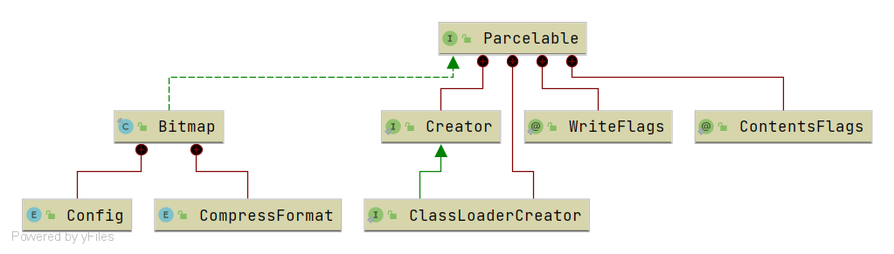

#  `Bitmap` 简介

## 预备知识

`Bitmap` 是 Android 开发中常用的图像处理类，自 API 1 就被引入。主要可以用来对图像进行颜色变换、剪切、旋转、缩放、格式转换等操作。



`Bitmap` 实现了 `Parcelable` 接口用于在内存中进行传递。它还有两个内部类 `Config` 和 `CompressFormat`。前者用来设置位图像素的存储格式，后者用来设置压缩方式。

### `Config`

表示位图像素的存储格式。有以下几个选项：

- `ALPHA_8`：颜色信息只由透明度组成，占 8 位
- `RGB_565`：颜色信息由 R、G、B 三部分组成，分别占 5、6、5 位，共 16 位
- `ARGB_4444`：颜色信息由 A（透明度）、R（红色）、G（绿色）、B（蓝色）四部分组成，每部分占 4 位，共 16 位
- `ARGB_8888`：颜色信息由 A、R、G、B 四部分组成，每部分占 8 位，共 32 位。**这是 Android 种默认的存储格式**
- `RGBA_F16`：颜色信息由 A、R、G、B 四部分组成，共 32 位。每个通道采用半精度浮点数存储

可以看出，不同的格式会对图片的内存占用产生影响。与默认的 `ARGB_8888` 相比，`RGB_565` 可以减少一半的内存占用。这也是优化图片内存占用的一个思路。

### `CompressFormat`

表示位图的压缩方式。有以下几个选项：

- `JPEG`：采用 JPEG 压缩
- `PNG`：采用 PNG 压缩
- `WEBP`：采用 WEBP 压缩。自 Android Q（API 29）起，当采用 `WEBP` 时，若 `quality` 设置为 100 则采用无损压缩方式，反之采用有损压缩

## `BitmapFactory`

`BitmapFactory` 用于创建一个 `Bitmap` 对象，有以下方法：

```java
// BitmapFactory.java
public static Bitmap decodeFile(String pathName, Options opts);

public static Bitmap decodeFile(String pathName);

public static Bitmap decodeResourceStream(Resources res, TypedValue value, InputStream is, Rect pad, Options opts);

public static Bitmap decodeResource(Resources res, int id, Options opts);

public static Bitmap decodeResource(Resources res, int id);

public static Bitmap decodeByteArray(byte[] data, int offset, int length, Options opts);

public static Bitmap decodeByteArray(byte[] data, int offset, int length);
```

我们可以通过文件、流、Resource 和字节数组等方式创建一个 `Bitmap`。注意到有些方法含有参数 `opts`，通过这个参数我们可以设置加载配置。

### `Options`

`Options` 中有如下一些属性：

```java
// BitmapFactory.java

// 被复用的 Bitmap
public Bitmap inBitmap;

// 图片内容是否可变。复用时需要设置为 true
public boolean inMutable;

/**
 * If set to true, the decoder will return null (no bitmap), but
 * the <code>out...</code> fields will still be set, allowing the caller to
 * query the bitmap without having to allocate the memory for its pixels.
 */
// 如果为 true 则只获取 Bitmap 的宽高，不会获取其内容或分配内存
public boolean inJustDecodeBounds;

/**
 * 采样率。小于等于 1 表示不缩放。大于 1 表示对宽和高进行缩放，例如设置为 2 表示
 * 宽和高都缩小为原来的 1/2，图片总的像素数量缩小为原来的 1/4。
 * 如果设置的值不是 2 的整数次幂，则向下取到里设置值最近的 2 的整数次幂
 */
public int inSampleSize;

// 设置 Config 值，也就是图片格式
public Bitmap.Config inPreferredConfig = Bitmap.Config.ARGB_8888;

// 设置图片使用的色彩空间。如果为 null 则采用图片内置色彩空间或与 inPreferredConfig 关联的色彩空间
public ColorSpace inPreferredColorSpace = null;

/**
 * If true (which is the default), the resulting bitmap will have its
 * color channels pre-multipled by the alpha channel.
 * 如果为 true 则最终得到的图片的颜色通道会提前乘以透明通道。对没有透明通道的图片无效。
 * 一般不需要设置。
 */
public boolean inPremultiplied;

// 设置加载时的像素密度。这个值会影响到 Bitmap 在占用的内存大小
public int inDensity;

// Bitmap 即将被画到屏幕上的像素密度
public int inTargetDensity;

// 正在使用的屏幕的像素密度。这个属性几乎不会被用到，默认情况下一直是 0
public int inScreenDensity;

// 控制是否缩放
public boolean inScaled;

// 解码时的临时空间，官方建议 16K 大小
public byte[] inTempStorage;
```

## `Bitmap` 占用内存分析

假设我们有一张 PNG 格式的图片，其原始分辨率为 864x528，色彩模式为 32-bit（即 ARGB，每个像素占用 4 字节）。那么理论上来说，这张图片的像素信息应该占用 $864 \times 582 \times 4 = 2011392$ 字节的内存空间。现在将这张图片放置在 `drawable-xxhdpi` 目录下。使用的模拟器为 Pixel 3（设备分辨率 1080x2160，**440dpi**）。

首先，计算 `Bitmap`  内存大小有以下三种方式：

- `getRowBytes()`：这个在 API Level 1 添加的，返回的是 `Bitmap` 一行所占的大小，需要乘以 `Bitmap` 的高，才能得出 `Bitmap` 的大小
- `getByteCount()`：这个是在 API Level 12 添加的，其实是对 `getRowBytes()` 乘以高的封装
- `getAllocationByteCount()`：这个是在 API Level 19 添加的

对由这张图片创建的 `Bitmap` 调用这些方法，返回结果如下：

```
width = 792, height = 534, getRowBytes() = 3168, getByteCount() = 1691712, getAllocationByteCount() = 1691712
```

为什么宽、高和总字节数与前面的计算结果不一样呢？

先来看看 Android 中不同 DPI 对应的密度描述符：

|  DPI 范围   | 对应的密度描述符 |
| :---------: | :--------------: |
|  0~120 dpi  |      `ldpi`      |
| 120~160 dpi |      `mdpi`      |
| 160~240 dpi |      `hdpi`      |
| 240~320 dpi |     `xhdpi`      |
| 320~480 dpi |     `xxhdpi`     |
| 480~640 dpi |    `xxxhdpi`     |

对于每一档 DPI 范围，Android 系统以其上界为准。也就是说，系统会认为我们放在 `drawable-xxhdpi` 下的图片像素密度为 480dpi。因为屏幕实际的像素密度 440dpi 不足 480dpi，所以 Android 会对图片进行缩放。因此实际上 `Bitmap` 占用的内存大小计算方法是 $(宽 \times 缩放比例) \times (高 \times 缩放比例) \times 每个像素占用的内存大小$。

前面提到的图片，其缩放比例为 $440 / 480$，那么最终的大小就是 $2011392 \times (440 / 480)^{2} = 1691712$。乘上缩放比例之后的宽高会进行四舍五入处理。

### `Bitmap` 的创建流程

我们可以跟一下源代码（以下源代码来自 Android 10）。首先是 `Bitmap` 的构造函数。

```java
// Bitmap.java
// called from JNI and Bitmap_Delegate.
Bitmap(long nativeBitmap, int width, int height, int density,
        boolean requestPremultiplied, byte[] ninePatchChunk,
        NinePatch.InsetStruct ninePatchInsets, boolean fromMalloc) {
    if (nativeBitmap == 0) {
        throw new RuntimeException("internal error: native bitmap is 0");
    }

    mWidth = width;
    mHeight = height;
    mRequestPremultiplied = requestPremultiplied;

    mNinePatchChunk = ninePatchChunk;
    mNinePatchInsets = ninePatchInsets;
    if (density >= 0) {
        mDensity = density;
    }

    mNativePtr = nativeBitmap;

    final int allocationByteCount = getAllocationByteCount();
    NativeAllocationRegistry registry;
    if (fromMalloc) {
        registry = NativeAllocationRegistry.createMalloced(
                Bitmap.class.getClassLoader(), nativeGetNativeFinalizer(), allocationByteCount);
    } else {
        registry = NativeAllocationRegistry.createNonmalloced(
                Bitmap.class.getClassLoader(), nativeGetNativeFinalizer(), allocationByteCount);
    }
    registry.registerNativeAllocation(this, nativeBitmap);

    if (ResourcesImpl.TRACE_FOR_DETAILED_PRELOAD) {
        sPreloadTracingNumInstantiatedBitmaps++;
        long nativeSize = NATIVE_ALLOCATION_SIZE + allocationByteCount;
        sPreloadTracingTotalBitmapsSize += nativeSize;
    }
}
```

从注释知道，这个函数最终是由 Native 层通过 JNI 调用的，也就是说构造 `Bitmap` 的实际操作是由 Native 层完成的。我们跟一下 `BitmapFactory#decodeResource()`。

```java
// BitmapFactory.java

public static Bitmap decodeResource(Resources res, int id, Options opts) {
    validate(opts);
    Bitmap bm = null;
    InputStream is = null;

    try {
        final TypedValue value = new TypedValue();
        is = res.openRawResource(id, value);

        bm = decodeResourceStream(res, value, is, null, opts);
    } catch (Exception e) {
        /*  do nothing.
            If the exception happened on open, bm will be null.
            If it happened on close, bm is still valid.
        */
    } finally {
        try {
            if (is != null) is.close();
        } catch (IOException e) {
            // Ignore
        }
    }

    if (bm == null && opts != null && opts.inBitmap != null) {
        throw new IllegalArgumentException("Problem decoding into existing bitmap");
    }

    return bm;
}

public static Bitmap decodeResourceStream(@Nullable Resources res, @Nullable TypedValue value,
                                          @Nullable InputStream is, @Nullable Rect pad, @Nullable Options opts) {
    // ...

    return decodeStream(is, pad, opts);
}

public static Bitmap decodeStream(@Nullable InputStream is, @Nullable Rect outPadding,
        @Nullable Options opts) {
    // we don't throw in this case, thus allowing the caller to only check
    // the cache, and not force the image to be decoded.
    if (is == null) {
        return null;
    }
    validate(opts);

    Bitmap bm = null;

    Trace.traceBegin(Trace.TRACE_TAG_GRAPHICS, "decodeBitmap");
    try {
        if (is instanceof AssetManager.AssetInputStream) {
            // ...
        } else {
            bm = decodeStreamInternal(is, outPadding, opts);
        }

        // ...
    } finally {
        Trace.traceEnd(Trace.TRACE_TAG_GRAPHICS);
    }

    return bm;
}

private static Bitmap decodeStreamInternal(@NonNull InputStream is,
        @Nullable Rect outPadding, @Nullable Options opts) {
    // ASSERT(is != null);
    byte [] tempStorage = null;
    if (opts != null) tempStorage = opts.inTempStorage;
    if (tempStorage == null) tempStorage = new byte[DECODE_BUFFER_SIZE];
    return nativeDecodeStream(is, tempStorage, outPadding, opts,
            Options.nativeInBitmap(opts),
            Options.nativeColorSpace(opts));
}

private static native Bitmap nativeDecodeStream(InputStream is, byte[] storage,
        Rect padding, Options opts, long inBitmapHandle, long colorSpaceHandle);
```

经过层层调用，最终走到了 Native 方法 `nativeDecodeStream` 中。

```c++
// BitmapFactory.cpp

static jobject nativeDecodeStream(JNIEnv* env, jobject clazz, jobject is, jbyteArray storage,
        jobject padding, jobject options, jlong inBitmapHandle, jlong colorSpaceHandle) {
    jobject bitmap = NULL;
    std::unique_ptr<SkStream> stream(CreateJavaInputStreamAdaptor(env, is, storage));
    if (stream.get()) {
        std::unique_ptr<SkStreamRewindable> bufferedStream(
                SkFrontBufferedStream::Make(std::move(stream), SkCodec::MinBufferedBytesNeeded()));
        SkASSERT(bufferedStream.get() != NULL);
        bitmap = doDecode(env, std::move(bufferedStream), padding, options, inBitmapHandle,
                          colorSpaceHandle);
    }
    return bitmap;
}

static jobject doDecode(JNIEnv* env, std::unique_ptr<SkStreamRewindable> stream,
                        jobject padding, jobject options, jlong inBitmapHandle,
                        jlong colorSpaceHandle) {
    // Set default values for the options parameters.
    int sampleSize = 1;
    bool onlyDecodeSize = false; // 是否只获取图片大小
    SkColorType prefColorType = kN32_SkColorType;
    bool isHardware = false;
    bool isMutable = false;
    float scale = 1.0f;
    bool requireUnpremultiplied = false;
    jobject javaBitmap = NULL;
    sk_sp<SkColorSpace> prefColorSpace = GraphicsJNI::getNativeColorSpace(colorSpaceHandle);
    // Update with options supplied by the client.
    // 解析 options 参数
    if (options != NULL) {
        sampleSize = env->GetIntField(options, gOptions_sampleSizeFieldID);
        // Correct a non-positive sampleSize.  sampleSize defaults to zero within the
        // options object, which is strange.
        if (sampleSize <= 0) {
            sampleSize = 1;
        }
        if (env->GetBooleanField(options, gOptions_justBoundsFieldID)) {
            onlyDecodeSize = true;
        }
        // initialize these, in case we fail later on
        env->SetIntField(options, gOptions_widthFieldID, -1);
        env->SetIntField(options, gOptions_heightFieldID, -1);
        env->SetObjectField(options, gOptions_mimeFieldID, 0);
        env->SetObjectField(options, gOptions_outConfigFieldID, 0);
        env->SetObjectField(options, gOptions_outColorSpaceFieldID, 0);
        // 解析 ColorType、复用参数等
        jobject jconfig = env->GetObjectField(options, gOptions_configFieldID);
        prefColorType = GraphicsJNI::getNativeBitmapColorType(env, jconfig);
        isHardware = GraphicsJNI::isHardwareConfig(env, jconfig);
        isMutable = env->GetBooleanField(options, gOptions_mutableFieldID);
        requireUnpremultiplied = !env->GetBooleanField(options, gOptions_premultipliedFieldID);
        javaBitmap = env->GetObjectField(options, gOptions_bitmapFieldID);
        // 计算缩放比例
        if (env->GetBooleanField(options, gOptions_scaledFieldID)) {
            // 获取图片当前密度指示符的密度
            const int density = env->GetIntField(options, gOptions_densityFieldID);
            // 获取设备 DPI
            const int targetDensity = env->GetIntField(options, gOptions_targetDensityFieldID);
            const int screenDensity = env->GetIntField(options, gOptions_screenDensityFieldID);
            if (density != 0 && targetDensity != 0 && density != screenDensity) {
                scale = (float) targetDensity / density;
            }
        }
    }
    if (isMutable && isHardware) {
        doThrowIAE(env, "Bitmaps with Config.HARDWARE are always immutable");
        return nullObjectReturn("Cannot create mutable hardware bitmap");
    }
    // Create the codec.
    NinePatchPeeker peeker;
    std::unique_ptr<SkAndroidCodec> codec;
    {
        SkCodec::Result result;
        std::unique_ptr<SkCodec> c = SkCodec::MakeFromStream(std::move(stream), &result,
                                                             &peeker);
        if (!c) {
            SkString msg;
            msg.printf("Failed to create image decoder with message '%s'",
                       SkCodec::ResultToString(result));
            return nullObjectReturn(msg.c_str());
        }
        codec = SkAndroidCodec::MakeFromCodec(std::move(c));
        if (!codec) {
            return nullObjectReturn("SkAndroidCodec::MakeFromCodec returned null");
        }
    }
    // Do not allow ninepatch decodes to 565.  In the past, decodes to 565
    // would dither, and we do not want to pre-dither ninepatches, since we
    // know that they will be stretched.  We no longer dither 565 decodes,
    // but we continue to prevent ninepatches from decoding to 565, in order
    // to maintain the old behavior.
    if (peeker.mPatch && kRGB_565_SkColorType == prefColorType) {
        prefColorType = kN32_SkColorType;
    }
    // Determine the output size.
    // 获取当前图片大小
    SkISize size = codec->getSampledDimensions(sampleSize);
    int scaledWidth = size.width();
    int scaledHeight = size.height();
    bool willScale = false;
    // Apply a fine scaling step if necessary.
    // 处理 sampleSize，默认 1
    if (needsFineScale(codec->getInfo().dimensions(), size, sampleSize)) {
        willScale = true;
        scaledWidth = codec->getInfo().width() / sampleSize;
        scaledHeight = codec->getInfo().height() / sampleSize;
    }
    // Set the decode colorType
    SkColorType decodeColorType = codec->computeOutputColorType(prefColorType);
    if (decodeColorType == kRGBA_F16_SkColorType && isHardware &&
            !uirenderer::HardwareBitmapUploader::hasFP16Support()) {
        decodeColorType = kN32_SkColorType;
    }
    sk_sp<SkColorSpace> decodeColorSpace = codec->computeOutputColorSpace(
            decodeColorType, prefColorSpace);
    // Set the options and return if the client only wants the size.
    if (options != NULL) {
        jstring mimeType = encodedFormatToString(
                env, (SkEncodedImageFormat)codec->getEncodedFormat());
        if (env->ExceptionCheck()) {
            return nullObjectReturn("OOM in encodedFormatToString()");
        }
        // 设置 options 中的 outWeight 和 outHeight
        env->SetIntField(options, gOptions_widthFieldID, scaledWidth);
        env->SetIntField(options, gOptions_heightFieldID, scaledHeight);
        env->SetObjectField(options, gOptions_mimeFieldID, mimeType);
        jint configID = GraphicsJNI::colorTypeToLegacyBitmapConfig(decodeColorType);
        if (isHardware) {
            configID = GraphicsJNI::kHardware_LegacyBitmapConfig;
        }
        jobject config = env->CallStaticObjectMethod(gBitmapConfig_class,
                gBitmapConfig_nativeToConfigMethodID, configID);
        env->SetObjectField(options, gOptions_outConfigFieldID, config);
        env->SetObjectField(options, gOptions_outColorSpaceFieldID,
                GraphicsJNI::getColorSpace(env, decodeColorSpace.get(), decodeColorType));
        // 如果只获取图片大小，返回空
        if (onlyDecodeSize) {
            return nullptr;
        }
    }
    // Scale is necessary due to density differences.
    // 计算 scaledWidth 和 scaledHeight
    if (scale != 1.0f) {
        willScale = true;
        scaledWidth = static_cast<int>(scaledWidth * scale + 0.5f);
        scaledHeight = static_cast<int>(scaledHeight * scale + 0.5f);
    }
    // 判断是否存在复用的 Bitmap
    android::Bitmap* reuseBitmap = nullptr;
    unsigned int existingBufferSize = 0;
    if (javaBitmap != nullptr) {
        reuseBitmap = &bitmap::toBitmap(inBitmapHandle);
        if (reuseBitmap->isImmutable()) {
            // 不可变的 Bitmap 无法复用
            ALOGW("Unable to reuse an immutable bitmap as an image decoder target.");
            javaBitmap = nullptr;
            reuseBitmap = nullptr;
        } else {
            existingBufferSize = reuseBitmap->getAllocationByteCount();
        }
    }
    HeapAllocator defaultAllocator;
    RecyclingPixelAllocator recyclingAllocator(reuseBitmap, existingBufferSize);
    ScaleCheckingAllocator scaleCheckingAllocator(scale, existingBufferSize);
    SkBitmap::HeapAllocator heapAllocator;
    SkBitmap::Allocator* decodeAllocator;
    if (javaBitmap != nullptr && willScale) {
        // This will allocate pixels using a HeapAllocator, since there will be an extra
        // scaling step that copies these pixels into Java memory.  This allocator
        // also checks that the recycled javaBitmap is large enough.
        decodeAllocator = &scaleCheckingAllocator;
    } else if (javaBitmap != nullptr) {
        decodeAllocator = &recyclingAllocator;
    } else if (willScale || isHardware) {
        // This will allocate pixels using a HeapAllocator,
        // for scale case: there will be an extra scaling step.
        // for hardware case: there will be extra swizzling & upload to gralloc step.
        decodeAllocator = &heapAllocator;
    } else {
        decodeAllocator = &defaultAllocator;
    }
    SkAlphaType alphaType = codec->computeOutputAlphaType(requireUnpremultiplied);
    // 创建 SkImageInfo，包含宽、高、颜色、透明度等信息
    const SkImageInfo decodeInfo = SkImageInfo::Make(size.width(), size.height(),
            decodeColorType, alphaType, decodeColorSpace);
    SkImageInfo bitmapInfo = decodeInfo;
    if (decodeColorType == kGray_8_SkColorType) {
        // The legacy implementation of BitmapFactory used kAlpha8 for
        // grayscale images (before kGray8 existed).  While the codec
        // recognizes kGray8, we need to decode into a kAlpha8 bitmap
        // in order to avoid a behavior change.
        bitmapInfo =
                bitmapInfo.makeColorType(kAlpha_8_SkColorType).makeAlphaType(kPremul_SkAlphaType);
    }
    // 解析 SkBitmap，设置 bitmapInfo，通过 tryAllocPixels 分配内存
    SkBitmap decodingBitmap;
    if (!decodingBitmap.setInfo(bitmapInfo) ||
            !decodingBitmap.tryAllocPixels(decodeAllocator)) {
        // SkAndroidCodec should recommend a valid SkImageInfo, so setInfo()
        // should only only fail if the calculated value for rowBytes is too
        // large.
        // tryAllocPixels() can fail due to OOM on the Java heap, OOM on the
        // native heap, or the recycled javaBitmap being too small to reuse.
        return nullptr;
    }
    // Use SkAndroidCodec to perform the decode.
    SkAndroidCodec::AndroidOptions codecOptions;
    codecOptions.fZeroInitialized = decodeAllocator == &defaultAllocator ?
            SkCodec::kYes_ZeroInitialized : SkCodec::kNo_ZeroInitialized;
    codecOptions.fSampleSize = sampleSize;
    // 获取像素值
    SkCodec::Result result = codec->getAndroidPixels(decodeInfo, decodingBitmap.getPixels(),
            decodingBitmap.rowBytes(), &codecOptions);
    switch (result) {
        case SkCodec::kSuccess:
        case SkCodec::kIncompleteInput:
            break;
        default:
            return nullObjectReturn("codec->getAndroidPixels() failed.");
    }
    // This is weird so let me explain: we could use the scale parameter
    // directly, but for historical reasons this is how the corresponding
    // Dalvik code has always behaved. We simply recreate the behavior here.
    // The result is slightly different from simply using scale because of
    // the 0.5f rounding bias applied when computing the target image size
    // 计算缩放因子
    const float scaleX = scaledWidth / float(decodingBitmap.width());
    const float scaleY = scaledHeight / float(decodingBitmap.height());
    jbyteArray ninePatchChunk = NULL;
    if (peeker.mPatch != NULL) {
        if (willScale) {
            peeker.scale(scaleX, scaleY, scaledWidth, scaledHeight);
        }
        size_t ninePatchArraySize = peeker.mPatch->serializedSize();
        ninePatchChunk = env->NewByteArray(ninePatchArraySize);
        if (ninePatchChunk == NULL) {
            return nullObjectReturn("ninePatchChunk == null");
        }
        jbyte* array = (jbyte*) env->GetPrimitiveArrayCritical(ninePatchChunk, NULL);
        if (array == NULL) {
            return nullObjectReturn("primitive array == null");
        }
        memcpy(array, peeker.mPatch, peeker.mPatchSize);
        env->ReleasePrimitiveArrayCritical(ninePatchChunk, array, 0);
    }
    jobject ninePatchInsets = NULL;
    if (peeker.mHasInsets) {
        ninePatchInsets = peeker.createNinePatchInsets(env, scale);
        if (ninePatchInsets == NULL) {
            return nullObjectReturn("nine patch insets == null");
        }
        if (javaBitmap != NULL) {
            env->SetObjectField(javaBitmap, gBitmap_ninePatchInsetsFieldID, ninePatchInsets);
        }
    }
    // 构造最终的 SkBitmap
    SkBitmap outputBitmap;
    if (willScale) {
        // Set the allocator for the outputBitmap.
        SkBitmap::Allocator* outputAllocator;
        if (javaBitmap != nullptr) {
            outputAllocator = &recyclingAllocator;
        } else {
            outputAllocator = &defaultAllocator;
        }
        SkColorType scaledColorType = decodingBitmap.colorType();
        // FIXME: If the alphaType is kUnpremul and the image has alpha, the
        // colors may not be correct, since Skia does not yet support drawing
        // to/from unpremultiplied bitmaps.
        // 注意这里设置的是 scaledWidth 和 scaledHeight
        outputBitmap.setInfo(
                bitmapInfo.makeWH(scaledWidth, scaledHeight).makeColorType(scaledColorType));
        // 分配内存
        if (!outputBitmap.tryAllocPixels(outputAllocator)) {
            // This should only fail on OOM.  The recyclingAllocator should have
            // enough memory since we check this before decoding using the
            // scaleCheckingAllocator.
            return nullObjectReturn("allocation failed for scaled bitmap");
        }
        SkPaint paint;
        // kSrc_Mode instructs us to overwrite the uninitialized pixels in
        // outputBitmap.  Otherwise we would blend by default, which is not
        // what we want.
        paint.setBlendMode(SkBlendMode::kSrc);
        paint.setFilterQuality(kLow_SkFilterQuality); // bilinear filtering
        // 将 decodingBitmap 画到 outputBitmap 上
        SkCanvas canvas(outputBitmap, SkCanvas::ColorBehavior::kLegacy);
        canvas.scale(scaleX, scaleY);
        canvas.drawBitmap(decodingBitmap, 0.0f, 0.0f, &paint);
    } else {
        outputBitmap.swap(decodingBitmap);
    }
    if (padding) {
        peeker.getPadding(env, padding);
    }
    // If we get here, the outputBitmap should have an installed pixelref.
    if (outputBitmap.pixelRef() == NULL) {
        return nullObjectReturn("Got null SkPixelRef");
    }
    if (!isMutable && javaBitmap == NULL) {
        // promise we will never change our pixels (great for sharing and pictures)
        outputBitmap.setImmutable();
    }
    bool isPremultiplied = !requireUnpremultiplied;
    // 如果存在复用的 Bitmap，则直接返回
    if (javaBitmap != nullptr) {
        bitmap::reinitBitmap(env, javaBitmap, outputBitmap.info(), isPremultiplied);
        outputBitmap.notifyPixelsChanged();
        // If a java bitmap was passed in for reuse, pass it back
        return javaBitmap;
    }
    int bitmapCreateFlags = 0x0;
    if (isMutable) bitmapCreateFlags |= android::bitmap::kBitmapCreateFlag_Mutable;
    if (isPremultiplied) bitmapCreateFlags |= android::bitmap::kBitmapCreateFlag_Premultiplied;
    if (isHardware) {
        sk_sp<Bitmap> hardwareBitmap = Bitmap::allocateHardwareBitmap(outputBitmap);
        if (!hardwareBitmap.get()) {
            return nullObjectReturn("Failed to allocate a hardware bitmap");
        }
        return bitmap::createBitmap(env, hardwareBitmap.release(), bitmapCreateFlags,
                ninePatchChunk, ninePatchInsets, -1);
    }
    // now create the java bitmap
    // 没有复用则创建一个新的 Bitmap
    return bitmap::createBitmap(env, defaultAllocator.getStorageObjAndReset(),
            bitmapCreateFlags, ninePatchChunk, ninePatchInsets, -1);
}
```

简单总结一下上述流程：

- 解析 Java 层传递过来的 `options` 参数，如 `sampleSize`、`isMutable`、`javaBitmap` 等，同时计算出 `scale`

- 获取当前图片的大小，根据 `sampleSize` 判断是否需要压缩，同时计算出 `scaledWidth` 和 `scaledHeight`。

- 设置 `options` 宽高为 `scaledWidth` 和 `scaledHeight`。如果只是解析宽高那么就直接返回，也就是 `options.inJustDecodeBounds = true` 时，**但是这里需要注意返回的是资源图片的宽高（也就是文件原始的宽高），并不是 `Bitmap` 最终的宽高**

- 创建 Native 层的 `SkImageInfo` 和 `SkBitmap`，然后调用 `tryAllocPixels` 分配图片的内存空间，调用 `getAndroidPixels()` 去解析像素值，**这里的 `decodingBitmap` 也并不是最终需要返回的 `Bitmap`，而是原资源图片的 `Bitmap`**

- 构造需要返回的 `outputBitmap`，如果需要缩放那么重新去开辟一块内存空间，如果不需要缩放直接调用 `swap()` 方法即可。最后判断有没有复用的 `javaBitmap`，如果有复用调用 `reinitBitmap()` 然后直接返回，如果没有则调用 `createBitmap()` 去创建一个新的 `Bitmap`

### `Bitmap` 的内存回收

在 Android 8.0 之前，`Bitmap` 的像素数据都是存放在 Java 堆中。从 Android 8.0 开始变为存放在 Native 堆中。也因此，`Bitmap` 会在 Java 层和 Native 层都有内存占用。Java 层的 `Bitmap` 对象当然由 GC 进行管理。那 Native 层呢？

在 `Bitmap` 中存在着一个 `recycle()` 方法，它会去调用 Native 方法 `nativeRecycle()`（实际上对应 Native 层的 `Bitmap_recycle()` 函数）。这个方法在 Android 10 之前会返回一个 `boolean` 值，从 Android 10 开始不再具有返回值。Google 这么修改的原因可能是因为，`Bitmap_recycle()` 之前永远返回的是 `JNI_TRUE`，显得不那么必要。

```cpp
// Bitmap.cpp

static void Bitmap_recycle(JNIEnv* env, jobject, jlong bitmapHandle) {
    LocalScopedBitmap bitmap(bitmapHandle);
    bitmap->freePixels();
}

class BitmapWrapper {
public:
    explicit BitmapWrapper(Bitmap* bitmap)
        : mBitmap(bitmap) { }
    void freePixels() {
        mInfo = mBitmap->info();
        mHasHardwareMipMap = mBitmap->hasHardwareMipMap();
        mAllocationSize = mBitmap->getAllocationByteCount();
        mRowBytes = mBitmap->rowBytes();
        mGenerationId = mBitmap->getGenerationID();
        mIsHardware = mBitmap->isHardware();
        mBitmap.reset();
    }

    // ...
};
```

在 Android 8.0 之后，如果手动调用 `recycle()` 方法，会立即释放内存，因为像素数据本身就是在 Native 层进行内存分配的。但在 Android 8.0 之前并不是这样的。以 Android 7.0 为例：

```cpp
static jboolean Bitmap_recycle(JNIEnv *env, jobject, jlong bitmapHandle) {
    LocalScopedBitmap bitmap(bitmapHandle);
    bitmap->freePixels();
    return JNI_TRUE;
}

void Bitmap::freePixels() {
    AutoMutex _lock(mLock);
    if (mPinnedRefCount == 0) {
        doFreePixels();
        mPixelStorageType = PixelStorageType::Invalid;
    }
}

void Bitmap::doFreePixels() {
    switch (mPixelStorageType) {
    case PixelStorageType::Invalid:
        // already free'd, nothing to do
        break;
    case PixelStorageType::External:
        mPixelStorage.external.freeFunc(mPixelStorage.external.address,
                mPixelStorage.external.context);
        break;
    case PixelStorageType::Ashmem:
        munmap(mPixelStorage.ashmem.address, mPixelStorage.ashmem.size);
        close(mPixelStorage.ashmem.fd);
        break;
    case PixelStorageType::Java:
        // 只是释放了 Java 层之前创建的引用
        JNIEnv* env = jniEnv();
        LOG_ALWAYS_FATAL_IF(mPixelStorage.java.jstrongRef,
                "Deleting a bitmap wrapper while there are outstanding strong "
                "references! mPinnedRefCount = %d", mPinnedRefCount);
        env->DeleteWeakGlobalRef(mPixelStorage.java.jweakRef);
        break;
    }
    if (android::uirenderer::Caches::hasInstance()) {
        android::uirenderer::Caches::getInstance().textureCache.releaseTexture(
                mPixelRef->getStableID());
    }
}
```

就算手动调用 `recycle()`，像素数据也不会立即释放，而是通过 `DeleteWeakGlobalRef` 交由 Java GC 进行回收。需要注意的是，前面一直强调释放的是“像素数据”，而不是 Native 层的 `Bitmap` 对象。

然而在开发中，我们一般并不会手动去调用这个方法。那 Native 层的 `Bitmap` 在什么时候回收呢？

在 Android 7.0 之前，`Bitmap` 的内存回收主要通过 `BitmapFinalizer` 完成。

```java
// Bitmap.java

Bitmap(long nativeBitmap, byte[] buffer, int width, int height, int density,
        boolean isMutable, boolean requestPremultiplied,
        byte[] ninePatchChunk, NinePatch.InsetStruct ninePatchInsets) {
    if (nativeBitmap == 0) {
        throw new RuntimeException("internal error: native bitmap is 0");
    }
    mWidth = width;
    mHeight = height;
    mIsMutable = isMutable;
    mRequestPremultiplied = requestPremultiplied;
    mBuffer = buffer;
    mNinePatchChunk = ninePatchChunk;
    mNinePatchInsets = ninePatchInsets;
    if (density >= 0) {
        mDensity = density;
    }
    mNativePtr = nativeBitmap;
    mFinalizer = new BitmapFinalizer(nativeBitmap);
    int nativeAllocationByteCount = (buffer == null ? getByteCount() : 0);
    mFinalizer.setNativeAllocationByteCount(nativeAllocationByteCount);
}

private static class BitmapFinalizer {
    private long mNativeBitmap;
    // Native memory allocated for the duration of the Bitmap,
    // if pixel data allocated into native memory, instead of java byte[]
    private int mNativeAllocationByteCount;
    BitmapFinalizer(long nativeBitmap) {
        mNativeBitmap = nativeBitmap;
    }
    public void setNativeAllocationByteCount(int nativeByteCount) {
        if (mNativeAllocationByteCount != 0) {
            VMRuntime.getRuntime().registerNativeFree(mNativeAllocationByteCount);
        }
        mNativeAllocationByteCount = nativeByteCount;
        if (mNativeAllocationByteCount != 0) {
            VMRuntime.getRuntime().registerNativeAllocation(mNativeAllocationByteCount);
        }
    }
    @Override
    public void finalize() {
        try {
            super.finalize();
        } catch (Throwable t) {
            // Ignore
        } finally {
            // GC 回收时调用
            setNativeAllocationByteCount(0);
            nativeDestructor(mNativeBitmap);
            mNativeBitmap = 0;
        }
    }
}
```

从 Android 7.0 开始，会在 `Bitmap` 的构造方法中（前面有源代码）注册 Native 的 `Finalizer`。

```java
NativeAllocationRegistry registry;
if (fromMalloc) {
    registry = NativeAllocationRegistry.createMalloced(
        Bitmap.class.getClassLoader(), nativeGetNativeFinalizer(), allocationByteCount);
} else {
    registry = NativeAllocationRegistry.createNonmalloced(
        Bitmap.class.getClassLoader(), nativeGetNativeFinalizer(), allocationByteCount);
}
registry.registerNativeAllocation(this, nativeBitmap);
```

`NativeAllocationRegistry` 的源代码如下：

```java
// luni/src/main/java/libcore/util/NativeAllocationRegistry.java

package libcore.util;
import dalvik.system.VMRuntime;
import sun.misc.Cleaner;
import java.lang.ref.Reference;
/**
 * A NativeAllocationRegistry is used to associate native allocations with
 * Java objects and register them with the runtime.
 * There are two primary benefits of registering native allocations associated
 * with Java objects:
 * <ol>
 *  <li>The runtime will account for the native allocations when scheduling
 *  garbage collection to run.</li>
 *  <li>The runtime will arrange for the native allocation to be automatically
 *  freed by a user-supplied function when the associated Java object becomes
 *  unreachable.</li>
 * </ol>
 * A separate NativeAllocationRegistry should be instantiated for each kind
 * of native allocation, where the kind of a native allocation consists of the
 * native function used to free the allocation and the estimated size of the
 * allocation. Once a NativeAllocationRegistry is instantiated, it can be
 * used to register any number of native allocations of that kind.
 * @hide
 */
@libcore.api.CorePlatformApi
@libcore.api.IntraCoreApi
public class NativeAllocationRegistry {
    private final ClassLoader classLoader;
    // Pointer to native deallocation function of type void f(void* freeFunction).
    private final long freeFunction;
    // The size of the registered native objects. This can be, and usually is, approximate.
    // The least significant bit is one iff the object was allocated primarily with system
    // malloc().
    // This field is examined by ahat and other tools. We chose this encoding of the "is_malloced"
    // information to (a) allow existing readers to continue to work with minimal confusion,
    // and (b) to avoid adding a field to NativeAllocationRegistry objects.
    private final long size;
    // Bit mask for "is_malloced" information.
    private static final long IS_MALLOCED = 0x1;
    /**
     * Return a NativeAllocationRegistry for native memory that is mostly
     * allocated by means other than the system memory allocator. For example,
     * the memory may be allocated directly with mmap.
     * @param classLoader  ClassLoader that was used to load the native
     *                     library defining freeFunction.
     *                     This ensures that the the native library isn't unloaded
     *                     before freeFunction is called.
     * @param freeFunction address of a native function of type
     *                     <code>void f(void* nativePtr)</code> used to free this
     *                     kind of native allocation
     * @param size         estimated size in bytes of the part of the described
     *                     native memory that is not allocated with system malloc.
     *                     Approximate values are acceptable.
     * @throws IllegalArgumentException If <code>size</code> is negative
     */
    @libcore.api.CorePlatformApi
    public static NativeAllocationRegistry createNonmalloced(
            ClassLoader classLoader, long freeFunction, long size) {
        return new NativeAllocationRegistry(classLoader, freeFunction, size, false);
    }
    /**
     * Return a NativeAllocationRegistry for native memory that is mostly
     * allocated by the system memory allocator.
     * For example, the memory may be allocated directly with new or malloc.
     * <p>
     * The native function should have the type:
     * <pre>
     *    void f(void* nativePtr);
     * </pre>
     * <p>
     * @param classLoader  ClassLoader that was used to load the native
     *                     library freeFunction belongs to.
     * @param freeFunction address of a native function of type
     *                     <code>void f(void* nativePtr)</code> used to free this
     *                     kind of native allocation
     * @param size         estimated size in bytes of the part of the described
     *                     native memory allocated with system malloc.
     *                     Approximate values are acceptable. For sizes less than
     *                     a few hundered KB, use the simplified overload below.
     * @throws IllegalArgumentException If <code>size</code> is negative
     */
    @libcore.api.CorePlatformApi
    public static NativeAllocationRegistry createMalloced(
            ClassLoader classLoader, long freeFunction, long size) {
        return new NativeAllocationRegistry(classLoader, freeFunction, size, true);
    }
    /**
     * Return a NativeAllocationRegistry for native memory that is mostly
     * allocated by the system memory allocator. This version is preferred
     * for smaller objects (typically less than a few hundred KB).
     * @param classLoader  ClassLoader that was used to load the native
     *                     library freeFunction belongs to.
     * @param freeFunction address of a native function of type
     *                     <code>void f(void* nativePtr)</code> used to free this
     *                     kind of native allocation
     */
    @libcore.api.CorePlatformApi
    @libcore.api.IntraCoreApi
    public static NativeAllocationRegistry createMalloced(
            ClassLoader classLoader, long freeFunction) {
        return new NativeAllocationRegistry(classLoader, freeFunction, 0, true);
    }
    /**
     * Constructs a NativeAllocationRegistry for a particular kind of native
     * allocation.
     * <p>
     * The <code>size</code> should be an estimate of the total number of
     * native bytes this kind of native allocation takes up. Different
     * NativeAllocationRegistrys must be used to register native allocations
     * with different estimated sizes, even if they use the same
     * <code>freeFunction</code>. This is used to help inform the garbage
     * collector about the possible need for collection. Memory allocated with
     * native malloc is implicitly included, and ideally should not be included in this
     * argument.
     * <p>
     * @param classLoader  ClassLoader that was used to load the native
     *                     library freeFunction belongs to.
     * @param freeFunction address of a native function used to free this
     *                     kind of native allocation
     * @param size         estimated size in bytes of this kind of native
     *                     allocation. If mallocAllocation is false, then this
     *                     should ideally exclude memory allocated by system
     *                     malloc. However including it will simply double-count it,
     *                     typically resulting in slightly increased GC frequency.
     *                     If mallocAllocation is true, then this affects only the
     *                     frequency with which we sample the malloc heap, and debugging
     *                     tools. In this case a value of zero is commonly used to
     *                     indicate an unknown non-huge size.
     * @param mallocAllocation the native object is primarily allocated via malloc.
     */
    private NativeAllocationRegistry(ClassLoader classLoader, long freeFunction, long size,
            boolean mallocAllocation) {
        if (size < 0) {
            throw new IllegalArgumentException("Invalid native allocation size: " + size);
        }
        this.classLoader = classLoader;
        this.freeFunction = freeFunction;
        this.size = mallocAllocation ? (size | IS_MALLOCED) : (size & ~IS_MALLOCED);
    }
    /**
     * Constructs a NativeAllocationRegistry for a particular kind of native
     * allocation.
     * <p>
     * New code should use the preceding factory methods rather than calling this
     * constructor directly.
     * <p>
     * The <code>size</code> should be an estimate of the total number of
     * native bytes this kind of native allocation takes up excluding bytes allocated
     * with system malloc. Different
     * NativeAllocationRegistrys must be used to register native allocations
     * with different estimated sizes, even if they use the same
     * <code>freeFunction</code>. This is used to help inform the garbage
     * collector about the possible need for collection. Memory allocated with
     * native malloc is implicitly included, and ideally should not be included in this
     * argument.
     * <p>
     * @param classLoader  ClassLoader that was used to load the native
     *                     library freeFunction belongs to.
     * @param freeFunction address of a native function used to free this
     *                     kind of native allocation
     * @param size         estimated size in bytes of this kind of native
     *                     allocation, excluding memory allocated with system malloc.
     *                     A value of 0 indicates that the memory was allocated mainly
     *                     with malloc.
     *
     * @param mallocAllocation the native object is primarily allocated via malloc.
     */
    @libcore.api.CorePlatformApi
    public NativeAllocationRegistry(ClassLoader classLoader, long freeFunction, long size) {
        this(classLoader, freeFunction, size, size == 0);
    }
    /**
     * Registers a new native allocation and associated Java object with the
     * runtime.
     * This NativeAllocationRegistry's <code>freeFunction</code> will
     * automatically be called with <code>nativePtr</code> as its sole
     * argument when <code>referent</code> becomes unreachable. If you
     * maintain copies of <code>nativePtr</code> outside
     * <code>referent</code>, you must not access these after
     * <code>referent</code> becomes unreachable, because they may be dangling
     * pointers.
     * <p>
     * The returned Runnable can be used to free the native allocation before
     * <code>referent</code> becomes unreachable. The runnable will have no
     * effect if the native allocation has already been freed by the runtime
     * or by using the runnable.
     * <p>
     * WARNING: This unconditionally takes ownership, i.e. deallocation
     * responsibility of nativePtr. nativePtr will be DEALLOCATED IMMEDIATELY
     * if the registration attempt throws an exception (other than one reporting
     * a programming error).
     *
     * @param referent      Non-null java object to associate the native allocation with
     * @param nativePtr     Non-zero address of the native allocation
     * @return runnable to explicitly free native allocation
     * @throws IllegalArgumentException if either referent or nativePtr is null.
     * @throws OutOfMemoryError  if there is not enough space on the Java heap
     *                           in which to register the allocation. In this
     *                           case, <code>freeFunction</code> will be
     *                           called with <code>nativePtr</code> as its
     *                           argument before the OutOfMemoryError is
     *                           thrown.
     */
    @libcore.api.CorePlatformApi
    @libcore.api.IntraCoreApi
    public Runnable registerNativeAllocation(Object referent, long nativePtr) {
        if (referent == null) {
            throw new IllegalArgumentException("referent is null");
        }
        if (nativePtr == 0) {
            throw new IllegalArgumentException("nativePtr is null");
        }
        CleanerThunk thunk;
        CleanerRunner result;
        try {
            thunk = new CleanerThunk();
            Cleaner cleaner = Cleaner.create(referent, thunk);
            result = new CleanerRunner(cleaner);
            registerNativeAllocation(this.size);
        } catch (VirtualMachineError vme /* probably OutOfMemoryError */) {
            applyFreeFunction(freeFunction, nativePtr);
            throw vme;
        } // Other exceptions are impossible.
        // Enable the cleaner only after we can no longer throw anything, including OOME.
        thunk.setNativePtr(nativePtr);
        // Ensure that cleaner doesn't get invoked before we enable it.
        Reference.reachabilityFence(referent);
        return result;
    }
    private class CleanerThunk implements Runnable {
        private long nativePtr;
        public CleanerThunk() {
            this.nativePtr = 0;
        }
        public void run() {
            if (nativePtr != 0) {
                applyFreeFunction(freeFunction, nativePtr);
                registerNativeFree(size);
            }
        }
        public void setNativePtr(long nativePtr) {
            this.nativePtr = nativePtr;
        }
    }
    private static class CleanerRunner implements Runnable {
        private final Cleaner cleaner;
        public CleanerRunner(Cleaner cleaner) {
            this.cleaner = cleaner;
        }
        public void run() {
            cleaner.clean();
        }
    }
    // Inform the garbage collector of the allocation. We do this differently for
    // malloc-based allocations.
    private static void registerNativeAllocation(long size) {
        VMRuntime runtime = VMRuntime.getRuntime();
        if ((size & IS_MALLOCED) != 0) {
            final long notifyImmediateThreshold = 300000;
            if (size >= notifyImmediateThreshold) {
                runtime.notifyNativeAllocationsInternal();
            } else {
                runtime.notifyNativeAllocation();
            }
        } else {
            runtime.registerNativeAllocation(size);
        }
    }
    // Inform the garbage collector of deallocation, if appropriate.
    private static void registerNativeFree(long size) {
        if ((size & IS_MALLOCED) == 0) {
            VMRuntime.getRuntime().registerNativeFree(size);
        }
    }
    /**
     * Calls <code>freeFunction</code>(<code>nativePtr</code>).
     * Provided as a convenience in the case where you wish to manually free a
     * native allocation using a <code>freeFunction</code> without using a
     * NativeAllocationRegistry.
     */
    @libcore.api.CorePlatformApi
    public static native void applyFreeFunction(long freeFunction, long nativePtr);
}
```

其实无论是 Android 7.0 之前还是之后，释放 Native 层的 `Bitmap` 对象的思想都是去监听 Java 层的 `Bitmap` 是否被释放，一旦当 Java 层的 `Bitmap` 对象被释放则立即去释放 Native 层的 `Bitmap`。只不过 Android 7.0 之前是基于 Java 的 GC 机制，而 Android 7.0 开始是注册 Native 的 `Finalizer` 方法。

## `Bitmap` 的复用

如果有个需求，是在同一个 `Imageview` 中可以加载不同的图片，那我们每次都去新建一个 `Bitmap` 对象，占用新的内存空间的话，就会使 `Bitmap` 频繁申请内存和释放内存，导致大量的 GC 和内存抖动。

Google 提供了一种方法可以复用 `Bitmap`。在创建时，指定 `inMutable` 参数为 `true`，`inBitmap` 参数为要被复用的 `Bitmap`。这样同一块内存空间就可以被多个 `Bitmap` 复用。

不过复用是有条件限制的：

- 需要指定 `inMutable` 为 `true`，设置 `inBitmap`
- 在 Android 4.4 之前，被解码的图像必须为 JPG 或 PNG 格式的图片资源，且大小和被复用的 `Bitmap`（即 `inBitmap`）占用内存大小一样，同时 `BitmapFactory.Options#inSampleSize ` 字段必须设置为 `1`；在 Android 4.4 之后，只需要被解码的图像大小不超过被复用的 `Bitmap` 即可。

## 参考资料

[非常详细！ Bitmap图片优化分析](https://mp.weixin.qq.com/s/RTRkNXOzrtb0T7FuG-vIwA)

[Android Bitmap 详解：关于 Bitamp 你所要知道的一切](https://www.jianshu.com/p/eef3daeeecbc)

[图形图像处理 - 我们所不知道的 Bitmap](https://www.jianshu.com/p/8e8ad414237e)

[Bitmap知识点集合](https://mp.weixin.qq.com/s/qOMFJYoULG6A_azZbb3Drg)