# `HashMap`

## 预备知识

### `HashMap` 概述

`HashMap` 的本质上是一个哈希表，因此**哈希函数、哈希冲突和扩容方案**就是必不可少的三个基本要素。作为数据结构，多线程并发访问下的**线程安全**问题也是要考虑在内的。

`HashMap` 属于 `Map` 集合体系中的一部分，同时实现了 `Serializable` 接口以便被序列化、`Cloneable` 接口以便被复制。

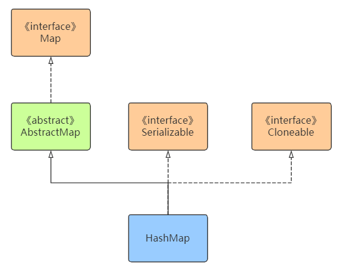

### `HashMap` 的底层数据结构

#### `table` 变量

```java
// HashMap.java
/**
 * The table, initialized on first use, and resized as
 * necessary. When allocated, length is always a power of two.
 * (We also tolerate length zero in some operations to allow
 * bootstrapping mechanics that are currently not needed.)
 */
transient Node<K,V>[] table;
```

`table` 用于存储添加到 `HashMap`中的键值对，是一个 `Node` 数组。而 `Node` 是一个静态内部类，实质上是一个链表。

#### 静态内部类 `Node`

```java
// HashMap.java
/**
 * Basic hash bin node, used for most entries.  (See below for
 * TreeNode subclass, and in LinkedHashMap for its Entry subclass.)
 */
static class Node<K,V> implements Map.Entry<K,V> {
    final int hash;
    final K key;
    V value;
    HashMap.Node<K,V> next;

    Node(int hash, K key, V value, HashMap.Node<K,V> next) {
        this.hash = hash;
        this.key = key;
        this.value = value;
        this.next = next;
    }

    public final K getKey()        { return key; }
    public final V getValue()      { return value; }
    public final String toString() { return key + "=" + value; }

    public final int hashCode() {
        return Objects.hashCode(key) ^ Objects.hashCode(value);
    }

    public final V setValue(V newValue) {
        V oldValue = value;
        value = newValue;
        return oldValue;
    }

    public final boolean equals(Object o) {
        if (o == this)
            return true;
        if (o instanceof Map.Entry) {
            Map.Entry<?,?> e = (Map.Entry<?,?>)o;
            if (Objects.equals(key, e.getKey()) &&
                    Objects.equals(value, e.getValue()))
                return true;
        }
        return false;
    }
}
```

数组和链表都有其各自的优点和缺点，数组连续存储，寻址容易，插入删除操作相对困难；而链表离散存储，寻址相对困难，而插入删除操作容易；而 `HashMap` 结合了这两种数据结构，保留了各自的优点，又弥补了各自的缺点。另外从 Java 8 开始，当链表长度太长时，会转为使用红黑树。

对于 `table` 数组和 `Node` 链表，它们的关系如下：

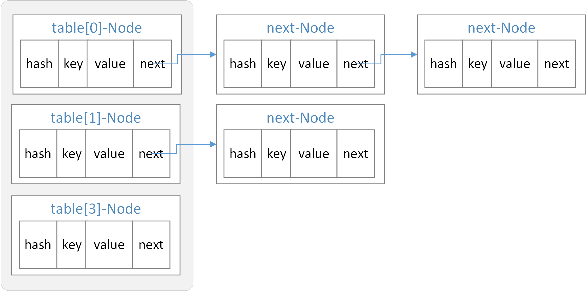

我们知道，哈希函数是将无限多的元素映射到一个有限的空间中，这样势必会发生多个不同的元素对应了同一个哈希值的情况。`table` 中存放的是相同哈希值的第一个元素，后续与该元素哈希值相同的其他元素会以链表的方式追加到第一个元素之后。例如元素 `A`、`B`、`C` 拥有相同的哈希值，`D`、`E` 拥有相同的哈希值，它们以提到的顺序被加入哈希表中，那么就如上图所示，有以下关系：

 ```java
table[0] = A;
table[0].next = B;
table[0].next.next = C;

table[1] = D;
table[1].next = E;
 ```

#### `entrySet` 变量

```java
// HashMap.java
/**
 * Holds cached entrySet(). Note that AbstractMap fields are used
 * for keySet() and values().
 */
transient Set<Map.Entry<K,V>> entrySet;
```

`entrySet` 是 `Map.Entry<K, V>` 的集合，而前面提到的 `Node` 类实现了 `Map.Entry<K, V>` 接口，所以实际上也就是 `Node` 的集合。

#### capacity 系列

```java
// HashMap.java
/**
 * The default initial capacity - MUST be a power of two.
 */
// 初始容量
static final int DEFAULT_INITIAL_CAPACITY = 1 << 4; // aka 16

/**
 * The maximum capacity, used if a higher value is implicitly specified
 * by either of the constructors with arguments.
 * MUST be a power of two <= 1<<30.
 */
// 桶数组的最大大小，需要是 2 的整数次幂并且不大于 1 << 30 (1073741824)
static final int MAXIMUM_CAPACITY = 1 << 30;
```

#### `size` 变量

```java
// HashMap.java
/**
 * The number of key-value mappings contained in this map.
 */
transient int size;
```

很好理解，就是 `HashMap` 中元素的数量。

#### `threshold` 和 `loadFactor` 变量

```java
/**
 * The next size value at which to resize (capacity * load factor).
 *
 * @serial
 */
// (The javadoc description is true upon serialization.
// Additionally, if the table array has not been allocated, this
// field holds the initial array capacity, or zero signifying
// DEFAULT_INITIAL_CAPACITY.)
int threshold;

/**
 * The load factor for the hash table.
 *
 * @serial
 */
final float loadFactor;

/**
 * The load factor used when none specified in constructor.
 */
static final float DEFAULT_LOAD_FACTOR = 0.75f;
```

顾名思义， `threshold` 就是临界值，超出后 `HashMap` 会进行自动扩容。具体来说 `threshold = capacity * loadFactor`。

`loadFactor` 是负载因子，用于衡量 `HashMap` 满的程度，默认值 `DEFAULT_LOAD_FACTOR` 即 `0.75f`，可以通过构造函数自行制定（一般不需要）。

## 哈希函数

在数据结构课程中，我们学习过哈希表，知道这是一个根据 key 去查找 value 的数据映射结构（某种意义上来讲也就是键值对的集合）。不过这里的 key 并不是我们在 `HashMap#get()` 中提供的参数，而是根据一个哈希函数对参数进行运算之后得到的值。

前面有提到，`HashMap` 首先会将元素放在 `table` 数组中。由于向数组指定下标放置（注意是放置不是插入）元素的时间复杂度是 $O(1)$，所以如果我们能通过某种方法直接确定好元素的下标，那么效率将大大提升。这就是哈希函数的作用。判断一个哈希函数的标准是：**散列是否均匀、计算是否简单**。

`HashMap` 哈希函数的会进行以下两步：

1. 求 key 的哈希值并对其进行扰动
2. 通过取模求得数组下标

扰动是为了让哈希值的随机性更高，取模是为了不让所有 key 都聚集在一起，提高散列均匀度。

`HashMap#hash()` 方法对对象的哈希值进行扰动：

```java
// HashMap.java
/**
 * Computes key.hashCode() and spreads (XORs) higher bits of hash
 * to lower.  Because the table uses power-of-two masking, sets of
 * hashes that vary only in bits above the current mask will
 * always collide. (Among known examples are sets of Float keys
 * holding consecutive whole numbers in small tables.)  So we
 * apply a transform that spreads the impact of higher bits
 * downward. There is a tradeoff between speed, utility, and
 * quality of bit-spreading. Because many common sets of hashes
 * are already reasonably distributed (so don't benefit from
 * spreading), and because we use trees to handle large sets of
 * collisions in bins, we just XOR some shifted bits in the
 * cheapest possible way to reduce systematic lossage, as well as
 * to incorporate impact of the highest bits that would otherwise
 * never be used in index calculations because of table bounds.
 */
static final int hash(Object key) {
    int h;
    // 获取到 key 的哈希值，在高低位异或运算
    return (key == null) ? 0 : (h = key.hashCode()) ^ (h >>> 16);
}
```

也就是低 16 位是和高 16 位进行异或，高 16 位保持不变。一般的数组长度都会比较短，取模运算中只有低位参与散列；高位与地位进行异或，让高位也得以参与散列运算，使得散列更加均匀。以 8 位图示如下：

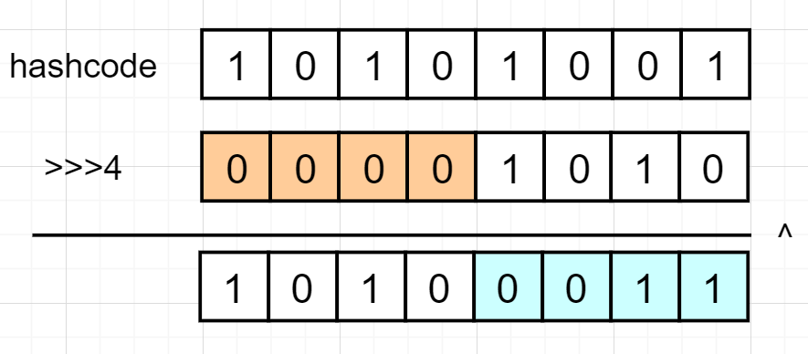

扰动之后需要对结果进行取模。`HashMap` 在 Java 8 中并不是简单使用 `%` 进行取模，而是采用了另外一种更加高性能的方法。同时 `HashMap` 控制数组长度为 2 的整数次幂，好处是对哈希值进行求余运算和让哈希值与 `数组长度 - 1` 进行与运算是相同的效果。而位与运算比求余的效率要高很多，因此也提升了性能。

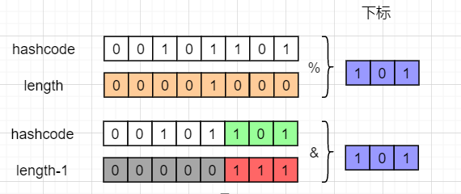

取模运算在 `putVal()` 方法中实现，这个方法会在 `put()` 中调用。

```java
// HashMap.java
/**
 * Implements Map.put and related methods.
 *
 * @param hash hash for key
 * @param key the key
 * @param value the value to put
 * @param onlyIfAbsent if true, don't change existing value
 * @param evict if false, the table is in creation mode.
 * @return previous value, or null if none
 */
final V putVal(int hash, K key, V value, boolean onlyIfAbsent,
               boolean evict) {
    // ...
    // 与数组长度 - 1 进行位与运算得到下标
    if ((p = tab[i = (n - 1) & hash]) == null)
        tab[i] = newNode(hash, key, value, null);
    else {
        // ...
    }
    // ...
    return null;
}
```

完整的哈希过程如下图：

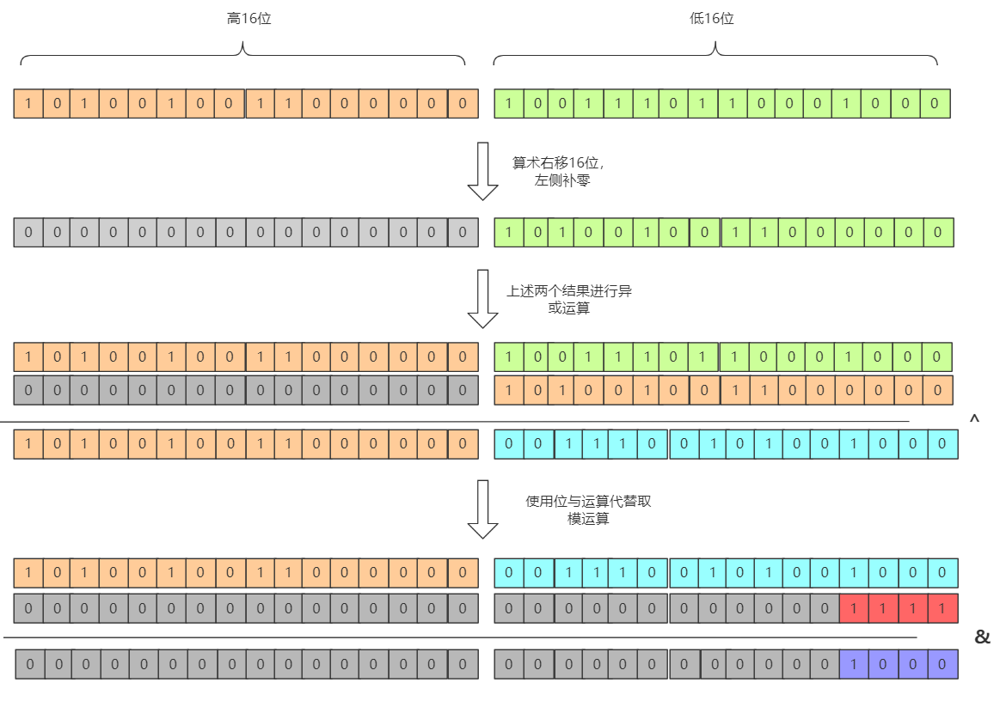

前面提到，`HashMap` 限制了 `table` 数组长度为 2 的整数次幂。那么具体是如何进行控制的呢？首先明确，在以下两种情况时会修改 `table` 数组长度：

- 初始化时指定长度
- 扩容时

首先讨论第一种情况。默认的初始长度为 16。这是一个根据经验得出的合适的值，首先它是 2 的整数次幂，而太小的话会频繁触发扩容，太大又会浪费空间。如果指定了一个不是 2 的整数次幂的数字，会**自动转化成最小的大于该数的 2 的整数次幂**。例如指定 6 则会转换为 8，指定 11 则会转化为 16。当在初始化时指定了一个不是 2 的整数次幂的容量，`HashMap` 会调用 `tableSizeFor()` 方法。

```java
// HashMap.java
public HashMap(int initialCapacity, float loadFactor) {
    // ...
    this.loadFactor = loadFactor;
    this.threshold = tableSizeFor(initialCapacity); // 这里调用了 tableSizeFor() 方法
}

/**
 * Returns a power of two size for the given target capacity.
 */
static final int tableSizeFor(int cap) {
    int n = cap - 1;// 这里必须减 1
    n |= n >>> 1;
    n |= n >>> 2;
    n |= n >>> 4;
    n |= n >>> 8;
    n |= n >>> 16;
    return (n < 0) ? 1 : (n >= MAXIMUM_CAPACITY) ? MAXIMUM_CAPACITY : n + 1;
}
```

`tableSizeFor()` 作用是使得最高位 1 后续的所有位都变为 1，最后再加 1 则得到刚好大于 `initialCapacity` 的最小 2 的整数次幂数。8 位模拟如下图（32 位同理）：


必须首先减 1 的原因是，如果指定的数字刚好是 2 的整数次幂，那么在不减 1 时就会变成这个数字的两倍。

然后讨论扩容这个情况。`HashMap` 每次扩容的大小都是原来的两倍，控制了数组大小一定是 2 的整数次幂。

```java
// HashMap.java
/**
 * Initializes or doubles table size.  If null, allocates in
 * accord with initial capacity target held in field threshold.
 * Otherwise, because we are using power-of-two expansion, the
 * elements from each bin must either stay at same index, or move
 * with a power of two offset in the new table.
 *
 * @return the table
 */
final HashMap.Node<K,V>[] resize() {
    HashMap.Node<K,V>[] oldTab = table;
    int oldCap = (oldTab == null) ? 0 : oldTab.length;
    int oldThr = threshold;
    int newCap, newThr = 0;
    if (oldCap > 0) {
        if (oldCap >= MAXIMUM_CAPACITY) {
            threshold = Integer.MAX_VALUE;
            return oldTab;
        }
        else if ((newCap = oldCap << 1) < MAXIMUM_CAPACITY &&
                oldCap >= DEFAULT_INITIAL_CAPACITY)
            newThr = oldThr << 1; // double threshold，设置为原来的两倍
    }
    // ...
    return newTab;
}
```

## 哈希冲突的解决

基于哈希函数本身的限制，哈希冲突是永远无法避免的。在数据结构中我们学习过的解决哈希冲突的办法有开放定址法、再哈希法、公共溢出表法、链地址法。`HashMap` 采用的是链地址法，而在 Java 8 之后又增加了红黑树的优化，如下图：

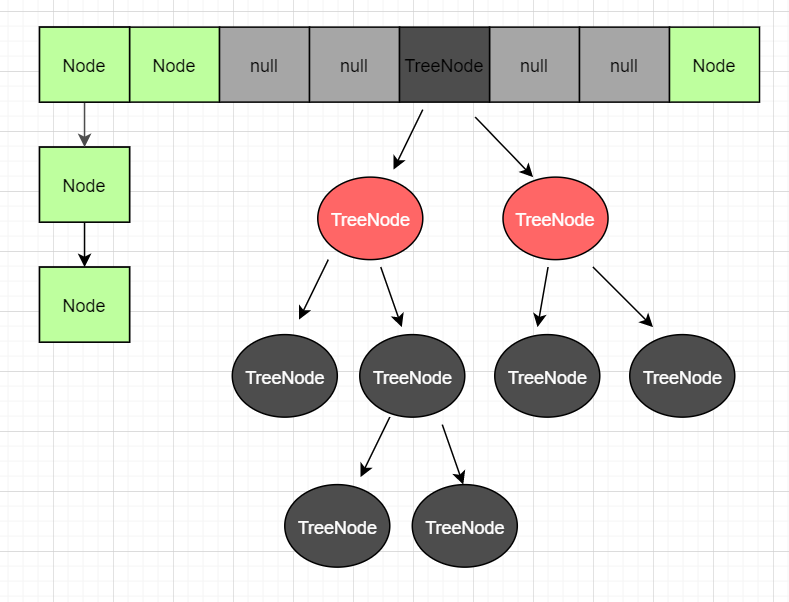

出现冲突后会在当前节点形成链表，而当链表过长之后，会自动转化成红黑树提高查找效率。红黑树是一个查找效率很高的数据结构，时间复杂度为 $O(logN)$，但红黑树只有在数据量较大时才能发挥它的优势。关于红黑树的转化，`HashMap` 做了以下限制

- 当链表的长度大于等于 8 且数组长度大于等于 64 时，会把链表转化成红黑树
- 当链表长度大于等于 8，但数组长度小于 64 时，会优先进行扩容，而不是转化成红黑树
- 当红黑树节点数小于等于 6 时，自动转化成链表

当数组长度达到 64 才转化为红黑树的原因是，当数组长度较短时，比如 16，链表长度达到 8 已经是占用了最大限度的 50%，意味着负载已经快要达到上限，此时如果转化成红黑树，之后的扩容又会再一次把红黑树拆分平均到新的数组中，这样非但没有带来性能的好处，反而会降低性能。所以在数组长度低于 64 时，优先进行扩容。

转化为红黑树的链表长度阈值为 8 是因为，树节点的比普通节点更大，在链表较短时红黑树并未能明显体现性能优势，反而会浪费空间。在理论数学计算中（`loadFactor` = 0.75），链表的长度到达 8 的概率是百万分之一；把 7 作为分水岭，大于 7 转化为红黑树，小于 7 转化为链表。红黑树的出现是为了在某些极端的情况下，抗住大量的哈希冲突，正常情况下使用链表是更加合适的。

## 扩容方案

随着 `HashMap` 中数据的增多，发生哈希冲突的概率也会提高，通过数组扩容，以空间换时间，保持查找效率稳定在常数时间复杂度。而扩容的时机在开头提到，与负载因子 `loadFactor` 有关。

负载因子 = `HashMap` 中的节点数量 / 总容量（也就是 `size` / `capacity`）。当节点数达到 `threshold` 时就会触发扩容。负载因子越大，数组利用率越高，但发生哈希冲突的概率也就越高；负载因子越小，数组利用率越低，但发生哈希冲突的概率也就越低。所以**装载因子的大小需要权衡空间与时间之间的关系**。在理论计算中，0.75 是一个比较合适的数值，大于 0.75 时哈希冲突的概率呈指数级别上升，而小于 0.75 时冲突减少并不明显。`HashMap中` 的负载因子的默认大小是 0.75，没有特殊要求的情况下，不建议修改。

在到达阈值之后，`HashMap` 会把数组长度扩展为原来的两倍，再把旧数组的数据迁移到新的数组，而 `HashMap` 针对迁移做了优化：利用 `HashMap` 数组长度是 2 的整数次幂的特点，以一种更高效率的方式完成数据迁移。

在 Java 8 之前，数据迁移就是重新计算所有节点的哈希值，然后插入到新数组的链表中。这样做的有两个缺点：

- 每个节点都需要进行一次求余
- 插入到新的数组时候采用的是头插入法，在多线程环境下会形成链表环

Java 8 中对这个操作进行了优化，基于“数组长度始终是 2 的整数次幂”这一前提，每次扩容之后的数组长度都是原来的 2 倍，这样 key 在新数组的哈希只有两种情况：在原来的位置；在原来的位置加上数组长度之后的新位置。

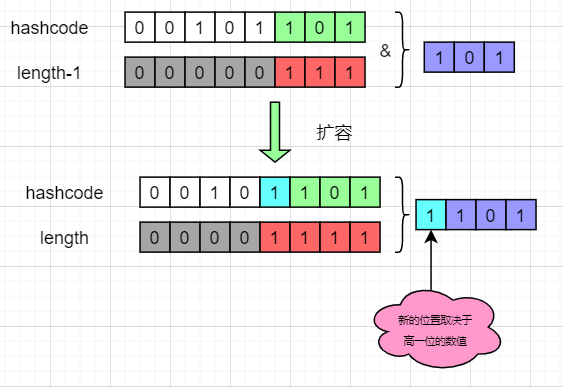

在新数组中的哈希结果，仅仅取决于高一位的数值。如果高一位是 0，那么计算结果就是在原位置，而如果是 1，则加上原数组的长度即可。这样我们**只需要判断一个节点的高一位是 1 还是 0，就可以得到他在新数组的位置，而不需要重复进行哈希计算**。`HashMap` 把每个链表拆分成两个链表，对应原位置或原位置 + 原数组长度，再分别插入到新的数组中，保留原来的节点顺序，如下图：

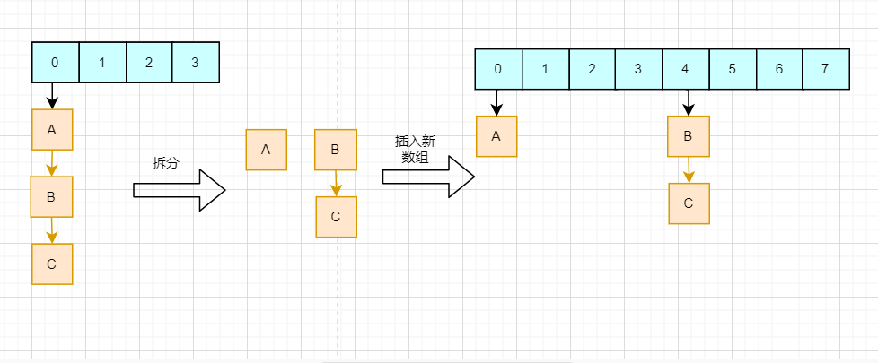

## 线程安全

### 问题

`HashMap` 既然是集合，那么在 CRUD 时就会涉及到多线程并发访问的情况。首先需要明确，`HashMap` 并不是线程安全的，在多线程下无法保证数据的一致性。例如，下标 2 的位置为 `null`，线程A需要将节点 X 插入下标 2 的位置，在判断是否为 `null` 之后，线程被挂起；此时线程 `B` 把新的节点 Y 插入到下标 2 的位置；恢复线程 A，节点 X 会直接插入到下标 2，覆盖节点 Y，导致数据丢失，如下图：

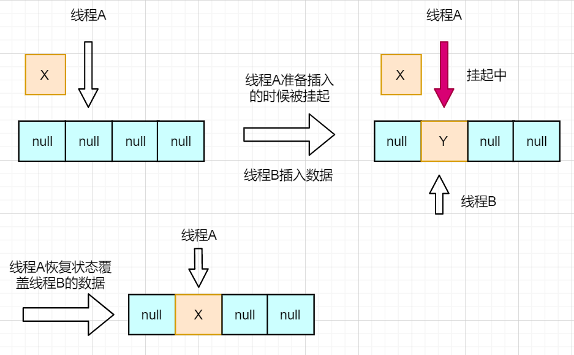

### 解决方案

在 Java 8 之前，扩容时使用的是头插法，速度快的同时，也带来了多线程下会产生链表环的问题，进而导致在下一次插入时因为找不到链表尾而发生死循环。Java 8 开始改用尾插法，解决了链表环的问题，但是还会存在数据一致性的问题。那么该如何解决呢？主要有下面三个方法：

- 采用 `Hashtable`（这是继承自 `Dictionary` 的一个类，现在已经不再使用了）
- 使用 `Collections.synchronizedMap()` 让 `HashMap` 具有多线程的能力
- 改用 `ConcurrentHashMap`

前两个方法的思路类似，均是在每个方法中对整个对象加锁。`Hashtable` 为每个方法都加上了 `sychronize` 关键字保证线程安全。

```java
// Hashtable.java
public synchronized int size() {
    // ...
}

public synchronized boolean isEmpty() {
    // ...
}

public synchronized Enumeration<K> keys() {
    // ...
}

public synchronized Enumeration<V> elements() {
    // ...
}

public synchronized boolean contains(Object value) {
    // ...
}

public synchronized boolean containsKey(Object key) {
    // ...
}

public synchronized V get(Object key) {
    // ...
}
```

`Collections.synchronizedMap()` 返回一个 `SynchronizedMap`，其内部使用互斥锁保证线程安全。而由于 `mutex` 锁实际上就是当前对象，因此会严重影响性能，并且同一时间只能有一个线程进行读写，限制了并发效率。

```java
public int size() {
    synchronized (mutex) {return m.size();}
}

public boolean isEmpty() {
    synchronized (mutex) {return m.isEmpty();}
}

public boolean containsKey(Object key) {
    synchronized (mutex) {return m.containsKey(key);}
}

public boolean containsValue(Object value) {
    synchronized (mutex) {return m.containsValue(value);}
}

public V get(Object key) {
    synchronized (mutex) {return m.get(key);}
}

public V put(K key, V value) {
    synchronized (mutex) {return m.put(key, value);}
}

public V remove(Object key) {
    synchronized (mutex) {return m.remove(key);}
}

public void putAll(Map<? extends K, ? extends V> map) {
    synchronized (mutex) {m.putAll(map);}
}

public void clear() {
    synchronized (mutex) {m.clear();}
}
```

`ConcurrentHashMap` 则是通过降低锁粒度 + CAS。简单来说，`ConcurrentHashMap` 锁住的并不是整个对象，而是**一个数组的一个节点**，那么其他线程访问数组其他节点是不会互相影响，极大提高了并发效率；同时 `ConcurrentHashMap` 读操作并不需要获取锁，如下图：

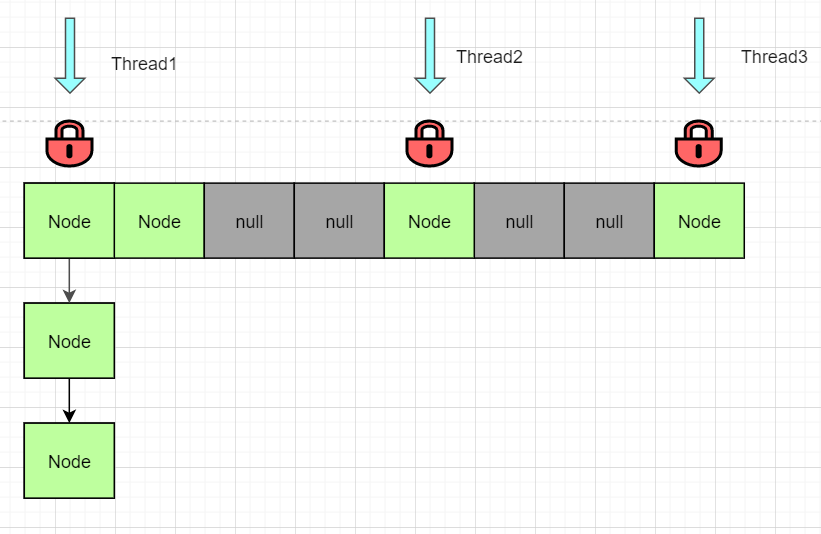

但上述三种方法也并非绝对的线程安全。考虑下面的代码：

```java
ConcurrentHashMap<String, String> map = new ConcurrentHashMap<>();
map.put("abc","123");

Thread thread1 = new Thread(() -> {
    if (map.containsKey("abc")){
        String s = map.get("abc");
    }
});
Thread thread2 = new Thread(() -> {
    map.remove("abc");
});
```

当 `thread1` 调用 `containsKey()` 之后释放锁，`thread2` 获得锁，移除 `"abc"` 并释放锁之后，`thread1` 中的 `s` 读到的就是 `null` 了。

### Fast-fail

当使用 `HashMap` 的迭代器遍历 `HashMap` 时，如果此时 `HashMap` 发生了结构性改变，如插入新数据、移除数据、扩容等，那么 `Iterator` 会抛出 fast-fail 异常，防止出现并发异常，在一定限度上保证了线程安全。

```java
// HashMap.java
final HashMap.Node<K,V> nextNode() {
    HashMap.Node<K,V>[] t;
    HashMap.Node<K,V> e = next;
    if (modCount != expectedModCount)
        throw new ConcurrentModificationException();
    if (e == null)
        throw new NoSuchElementException();
    if ((next = (current = e).next) == null && (t = table) != null) {
        do {} while (index < t.length && (next = t[index++]) == null);
    }
    return e;
}
```

创建 `Iterator` 时会记录 `HashMap` 的 `modCount` 变量。每当 `HashMap` 发生结构性改变时 `modCount` 会加 1。在迭代时 `Iterator` 通过判断 `HashMap` 的 `modCount` 和自己保存的 `expectedModCount` 是否一致，即可得知 `HashMap` 是否发生了结构性改变。

需要注意的是，迭代器的快速失败行为无法得到保证，它不能保证一定会出现该错误，但是快速失败操作会尽最大努力抛出 `ConcurrentModificationException` 异常。因此，为提高此类操作的正确性而编写一个依赖于此异常的程序是错误的做法。如果有并发需求，还是需要使用上述的三种办法。

## 源代码分析

### 扩容操作

```java
// HashMap.java
final Node<K,V>[] resize() {
    // 变量分别是原数组、原数组大小、原阈值；新数组大小、新阈值
    Node<K,V>[] oldTab = table;
    int oldCap = (oldTab == null) ? 0 : oldTab.length;
    int oldThr = threshold;
    int newCap, newThr = 0;
    
    // 如果原数组长度大于 0
    if (oldCap > 0) {
        // 如果已经超过了设置的最大长度 (1 << 30，也就是 Integer 范围内的最大的 2 的整数次幂)
        if (oldCap >= MAXIMUM_CAPACITY) {
            // 直接把阈值设置为最大正数
            threshold = Integer.MAX_VALUE;
            return oldTab;
        }
        else if ((newCap = oldCap << 1) < MAXIMUM_CAPACITY &&
                 oldCap >= DEFAULT_INITIAL_CAPACITY)
            // 设置为原来的两倍
            newThr = oldThr << 1; 
    }
    
    // 原数组长度为 0，但最大限度不是 0，把长度设置为阈值
    // 对应的情况就是新建 HashMap 的时候指定了数组长度
    else if (oldThr > 0) 
        newCap = oldThr;
    // 第一次初始化，默认 16 和 0.75
    // 对应使用默认构造器新建HashMap对象
    else {               
        newCap = DEFAULT_INITIAL_CAPACITY;
        newThr = (int)(DEFAULT_LOAD_FACTOR * DEFAULT_INITIAL_CAPACITY);
    }
    // 如果原数组长度小于 16 或者翻倍之后超过了最大限制长度，则重新计算阈值
    if (newThr == 0) {
        float ft = (float)newCap * loadFactor;
        newThr = (newCap < MAXIMUM_CAPACITY && ft < (float)MAXIMUM_CAPACITY ?
                  (int)ft : Integer.MAX_VALUE);
    }
    threshold = newThr;
    
    @SuppressWarnings({"rawtypes","unchecked"})
    // 建立新的数组
    Node<K,V>[] newTab = (Node<K,V>[])new Node[newCap];
    table = newTab;
    if (oldTab != null) {
        // 循环遍历原数组，并给每个节点计算新的位置
        for (int j = 0; j < oldCap; ++j) {
            Node<K,V> e;
            if ((e = oldTab[j]) != null) {
                oldTab[j] = null;
                // 如果他没有后继节点，那么直接使用新的数组长度取模得到新下标
                if (e.next == null)
                    newTab[e.hash & (newCap - 1)] = e;
                // 如果是红黑树，调用红黑树的拆解方法
                else if (e instanceof TreeNode)
                    ((TreeNode<K,V>)e).split(this, newTab, j, oldCap);
                // 新的位置只有两种可能：原位置，原位置 + 老数组长度
                // 把原链表拆成两个链表，然后再分别插入到新数组的两个位置上
                // 不用多次调用 put 方法
                else { 
                    // 分别是原位置不变的链表和原位置 + 原数组长度位置的链表
                    Node<K,V> loHead = null, loTail = null;
                    Node<K,V> hiHead = null, hiTail = null;
                    Node<K,V> next;
                    // 遍历老链表，判断新增判定位是 1 或 0 进行分类
                    do {
                        next = e.next;
                        if ((e.hash & oldCap) == 0) {
                            if (loTail == null)
                                loHead = e;
                            else
                                loTail.next = e;
                            loTail = e;
                        }
                        else {
                            if (hiTail == null)
                                hiHead = e;
                            else
                                hiTail.next = e;
                            hiTail = e;
                        }
                    } while ((e = next) != null);
                    // 最后赋值给新的数组
                    if (loTail != null) {
                        loTail.next = null;
                        newTab[j] = loHead;
                    }
                    if (hiTail != null) {
                        hiTail.next = null;
                        newTab[j + oldCap] = hiHead;
                    }
                }
            }
        }
    }
    // 返回新数组
    return newTab;
}
```

### 添加元素

前面提到过，`HashMap#put()` 最终会调用 `HashMap#putVal()`。

总体上分为两种情况：找到相同的 key 和找不到相同的 key。找了需要判断是否更新并返回旧 value，没找到需要插入新的节点、更新节点数并判断是否需要扩容。

查找分为三种情况：数组、链表、红黑树。数组下标 `i` 位置不为空且不等于 key，那么就需要判断是否树节点还是链表节点并进行查找。

```java
// HashMap.java
public V put(K key, V value) {
    // 获取哈希，再调用 putVal() 插入数据
    return putVal(hash(key), key, value, false, true);
}

// onlyIfAbsent 表示是否覆盖旧值，默认 false
// evict 和 LinkHashMap 的回调方法有关
final V putVal(int hash, K key, V value, boolean onlyIfAbsent,
               boolean evict) {
    
    // tab 是 HashMap 内部数组，n 是数组的长度，i 是要插入的下标，p 是该下标对应的节点
    Node<K,V>[] tab; Node<K,V> p; int n, i;
    
    // 判断数组是否为 null 或者是否没有元素，若是，则调用 resize() 方法进行扩容
    if ((tab = table) == null || (n = tab.length) == 0)
        n = (tab = resize()).length;
    
    // 使用位与运算代替取模得到下标
    // 判断当前下标是否为 null，若是则创建节点直接插入，否则进入下面 else
    if ((p = tab[i = (n - 1) & hash]) == null)
        tab[i] = newNode(hash, key, value, null);
    else {
        
        // e 表示和当前 key 相同的节点，若不存在该节点则为 null
        // k 是当前数组下标节点的 key
        Node<K,V> e; K k;
        
        // 判断当前节点与要插入的 key 是否相同，是则表示找到了已经存在的 key
        if (p.hash == hash &&
            ((k = p.key) == key || (key != null && key.equals(k))))
            e = p;
        // 判断该节点是否是树节点，如果是调用红黑树的方法进行插入
        else if (p instanceof TreeNode)
            e = ((TreeNode<K,V>)p).putTreeVal(this, tab, hash, key, value);
        // 最后一种情况是直接链表插入
        else {
            for (int binCount = 0; ; ++binCount) {
                if ((e = p.next) == null) {
                    p.next = newNode(hash, key, value, null);
                    // 长度大于等于8时转化为红黑树
                    // 注意，treeifyBin() 中会进行数组长度判断，
                    // 若小于 64，则优先进行数组扩容而不是转化为树
                    if (binCount >= TREEIFY_THRESHOLD - 1) 
                        treeifyBin(tab, hash);
                    break;
                }
                // 找到相同的直接跳出循环
                if (e.hash == hash &&
                    ((k = e.key) == key || (key != null && key.equals(k))))
                    break;
                p = e;
            }
        }
        
        // 如果找到相同的 key 节点，则判断 onlyIfAbsent 和旧值是否为 null
        // 执行更新或者不操作，最后返回旧值
        if (e != null) { 
            V oldValue = e.value;
            if (!onlyIfAbsent || oldValue == null)
                e.value = value;
            afterNodeAccess(e);
            return oldValue;
        }
    }
    
    // 如果不是更新旧值，说明 HashMap 中键值对数量发生变化
    // modCount 数值 +1 表示结构改变
    ++modCount;
    // 判断长度是否达到最大限度，如果是则进行扩容
    if (++size > threshold)
        resize();
    // 最后返回 null (afterNodeInsertion 是 LinkHashMap 的回调)
    afterNodeInsertion(evict);
    return null;
}
```

最后回顾一下整个流程：

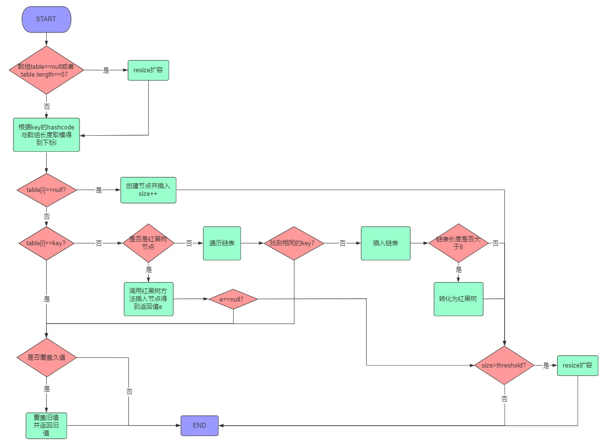

## 几个问题

#### 为什么 Java 8 之前控制数组的长度为素数，而 Java 8 开始采用的是2的整数次幂？

素数长度可以有效减少哈希冲突；Java 8 之后采用 2 的整数次幂是为了提高求余和扩容的效率，同时结合高低位异或的方法使得哈希散列更加均匀。

为何素数可以减少哈希冲突？若能保证 key 的哈希值在每个数字之间都是均匀分布，那么无论是素数还是合数都是相同的效果。例如哈希在 1~20 均匀分布，那么无论长度是合数 4，还是素数 5，分布都是均匀的。而如果哈希值之间的间隔都是 2，如 1、3、5……那么长度为 4 的数组，位置 2 和位置 4 两个下标无法放入数据，而长度为 5 的数组则没有这个问题。**长度为合数的数组会使间隔为其因子的哈希聚集出现，从而使得散列效果降低**。

#### 为什么插入 `HashMap` 的数据需要实现 `hashCode()` 和 `equals()` 方法？对这两个方法有什么要求？

通过 `hashCode()` 来确定插入下标，通过 `equals()` 比较来寻找数据；两个相等的 key 的哈希值必须相等，但拥有相同的哈希值的对象不一定相等。

`equals()` 比较内容是否相同，一般由对象覆盖重写，默认情况下比较的是引用地址；`==` 比较的是引用地址是否相同，值对象比较的是值是否相同。

`HashMap` 中需要使用哈希值来获取 key 的下标，如果两个相同的对象的哈希不同，那么会造成 `HashMap` 中存在相同的 key；所以如果多个 key 的 `equals()` 返回相同的值，那么它们的哈希值一定要相同。`HashMap` 比较两个元素是否相同采用了三种比较方法结合：`p.hash == hash && ((k = p.key) == key || (key != null && key.equals(k)))` 。

## 参考资料

[深入剖析HashMap](https://juejin.cn/post/6902793228026642446)

[HashMap原理(一) 概念和底层架构](https://www.cnblogs.com/LiaHon/p/11142958.html)