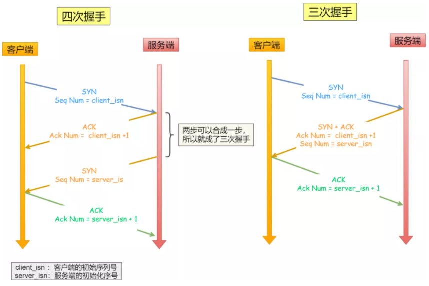

# TCP 和 UDP

## TCP

### 包头

- 序列号：在建立连接时由计算机生成的随机数作为其初始值，通过 SYN 包传给接收端主机，每发送一次数据，就累**加一次该数据字节数的大小**。**用来解决网络包乱序问题。**
- 确认应答号：指下一次期望收到的数据的序列号，发送端收到这个确认应答以后可以认为在这个序号以前的数据都已经被正常接收。**用来解决不丢包的问题。**
- 控制位
  - ACK：该位为 `1` 时，“确认应答”的字段变为有效，TCP 规定**除了最初建立连接时的 `SYN` 包之外该位必须设置为 `1`**。
  - RST：该位为 `1` 时，表示 TCP 连接中出现异常必须强制断开连接。
  - SYC：该位为 `1` 时，表示希望建立连，并在其序列号的字段进行序列号初始值的设定。
  - FIN：该位为 `1` 时，表示今后不会再有数据发送，希望断开连接。当通信结束希望断开连接时，通信双方的主机之间就可以相互交换 `FIN` 位置为 1 的 TCP 段。

### 为什么需要 TCP？TCP 工作位置？

IP 层不保证网络包的交付、不保证网络包的按序交付、也不保证网络包中的数据的完整性。如果需要保障网络数据包的可靠性，那么就需要由上层（传输层）的 TCP 协议来负责。因为 TCP 是一个工作在**传输层**的**可靠**数据传输的服务，它能确保接收端接收的网络包是**无损坏、无间隔、非冗余和按序的。**

### TCP 的概念

TCP 是**面向连接的、可靠的、基于字节流**的传输层通信协议。

- **面向连接**：一定是“一对一”才能连接，不能像 UDP 可以一个主机同时向多个主机发送消息，也就是一对多是无法做到的；
- **可靠的**：无论的网络链路中出现了怎样的链路变化，TCP 都可以保证一个报文一定能够到达接收端；
- **字节流**：消息是“没有边界”的，所以无论我们消息有多大都可以进行传输。并且消息是“有序的”，当“前一个”消息没有收到的时候，即使它先收到了后面的字节已经收到，那么也不能扔给应用层去处理，同时对“重复”的报文会自动丢弃。

### TCP 连接

用于保证可靠性和流量控制维护的某些状态信息，这些信息的组合，包括 Socket、序列号和窗口大小称为连接。因此建立一个 TCP 连接是需要客户端与服务器端达成上述三个信息的共识。

- **Socket**：由 IP 地址和端口号组成
- **序列号**：用来解决乱序问题等
- **窗口大小**：用来做流量控制

通过（源地址，源端口，目的地址，目的端口）四元组可以唯一确定一个 TCP 连接。其中两个 32 位的地址字段位于 IP 头中，用于通过 IP 协议将报文发送给接收方。两个 16 位的端口字段位于 TCP 头中，用于告知 TCP 协议将数据发送给哪个进程。

#### 最大连接数

$最大 TCP 连接数=客户端的IP数×客户端的端口数$ 

以上是理论值。对于 IPv4 来说，$最大值=2^{32}×2^{16}=2^{48}$。但实际中，受限于内存和 Socket，并不能达到理论值。

### TCP 连接的建立（三次握手）

首先客户端和服务器双方都处于 `CLOSED` 状态。然后服务器开始监听某一个端口，进入 `LISTEN` 状态。

#### 第一次握手：SYN

客户端会随机初始化序号（`client_isn`），将此序号置于 TCP 首部的“序号”字段中，同时把 `SYN` 标志位置为 `1` ，表示 `SYN` 报文。接着把第一个 SYN 报文发送给服务端，表示向服务端发起连接，该报文不包含应用层数据，之后客户端处于 `SYN-SENT` 状态。

#### 第二次握手：SYN + ACK

服务端收到客户端的 `SYN` 报文后，首先服务端也随机初始化自己的序号（`server_isn`），将此序号填入 TCP 首部的“序号”字段中，其次向 TCP 首部的“确认应答号”字段填入 `client_isn + 1`, 接着把 `SYN` 和 `ACK` 标志位置为 `1`。最后把该报文发给客户端，该报文也不包含应用层数据，之后服务端处于 `SYN-RCVD` 状态。

#### 第三次握手：ACK

客户端收到服务端报文后，还要向服务端回应最后一个应答报文，首先该应答报文 TCP 首部 `ACK` 标志位置为 `1` ，其次“确认应答号”字段填入 `server_isn + 1` ，最后把报文发送给服务端，**这次报文可以携带客户到服务器的数据**，之后客户端处于 `ESTABLISHED` 状态。

服务器收到客户端的应答报文后，也进入 `ESTABLISHED` 状态。此时双方连接已经建立，可以开始互相传输数据了。

#### 为什么需要三次握手

##### 避免历史连接

RFC 793 指出：

> The principle reason for the three-way handshake is to prevent old duplicate connection initiations from causing confusion.

三次握手是为了防止旧的重复连接初始化造成混乱。

客户端连续发送多次 SYN 建立连接的报文，在网络拥堵等情况下：

- 一个“旧 SYN 报文”比“最新的 SYN”报文早到达了服务端；
- 那么此时服务端就会回一个 `SYN + ACK` 报文给客户端；
- 客户端收到后可以根据自身的上下文，判断这是一个历史连接（序列号过期或超时），那么客户端就会发送 `RST` 报文给服务端，表示中止这一次连接。

如果是两次握手连接，就不能判断当前连接是否是历史连接，三次握手则可以在客户端（发送方）准备发送第三次报文时，客户端因有足够的上下文来判断当前连接是否是历史连接：

- 如果是历史连接（序列号过期或超时），则第三次握手发送的报文是 `RST` 报文，以此中止历史连接；
- 如果不是历史连接，则第三次发送的报文是 `ACK` 报文，通信双方就会成功建立连接；

所以， TCP 使用三次握手建立连接的最主要原因是**防止历史连接初始化了连接。**

##### 同步双方序列号

TCP 协议的通信双方，都必须维护一个序列号，序列号是可靠传输的一个关键因素，它的作用：

- 接收方可以去除重复的数据；
- 接收方可以根据数据包的序列号按序接收；
- 可以标识发送出去的数据包中，哪些是已经被对方收到的；

可见，序列号在 TCP 连接中占据着非常重要的作用，所以当客户端发送携带“初始序列号”的 SYN 报文的时候，需要服务端回一个 ACK 应答报文，表示客户端的 SYN 报文已被服务端成功接收，那当服务端发送“初始序列号”给客户端的时候，依然也要得到客户端的应答回应，**这样一来一回，才能确保双方的初始序列号能被可靠的同步。**

四次握手其实也能够可靠的同步双方的初始化序号，但由于**第二步和第三步可以优化成一步**，所以就成了“三次握手”。

而两次握手只保证了一方的初始序列号能被对方成功接收，没办法保证双方的初始序列号都能被确认接收。

##### 避免资源浪费

如果只有“两次握手”，当客户端的 `SYN` 请求连接在网络中阻塞，客户端没有接收到 `ACK` 报文，就会重新发送 `SYN` ，由于没有第三次握手，服务器不清楚客户端是否收到了自己发送的建立连接的 `ACK` 确认信号，所以每收到一个 `SYN` 就只能先主动建立一个连接，这样会导致，如果客户端的 `SYN` 阻塞了，重复发送多次 `SYN` 报文，那么服务器在收到请求后就会**建立多个冗余的无效链接，造成不必要的资源浪费。**即两次握手会造成消息滞留情况下，服务器重复接受无用的连接请求 `SYN` 报文，而造成重复分配资源。

#### 初始 ISN 的产生

初始 `ISN` 是基于时钟的，每 4 毫秒 + 1，转一圈要 4.55 个小时。

RFC1948 中提出了一个较好的初始化序列号 ISN 随机生成算法。

$ISN = M + F (localhost, localport, remotehost, remoteport)$

- $M$ 是一个计时器，这个计时器每隔 4 毫秒加 1。
- $F$ 是一个 Hash 算法，根据源 IP、目的 IP、源端口、目的端口生成一个随机数值。要保证 Hash 算法不能被外部轻易推算得出，用 MD5 算法是一个比较好的选择。

### TCP 连接的断开（四次挥手）

客户端和服务器都可以主动选择断开连接。这里以客户端主动断开为例。

#### 第一次挥手：FIN（客户端→服务器）

客户端打算关闭连接，此时会发送一个 TCP 首部 `FIN` 标志位被置为 `1` 的报文，也即 FIN 报文，之后客户端进入 `FIN_WAIT_1` 状态。

#### 第二次挥手：ACK（服务器→客户端）

服务端收到该报文后，就向客户端发送 ACK 应答报文，接着服务端进入 `CLOSED_WAIT` 状态。客户端收到服务端的 ACK 应答报文后，进入 `FIN_WAIT_2` 状态。

#### 第三次挥手：FIN（服务器→客户端）

服务端处理完数据后，也向客户端发送 FIN 报文，之后服务端进入 `LAST_ACK` 状态。

#### 第四次挥手：ACK（客户端→服务端）

客户端收到服务端的 `FIN` 报文后，回一个 ACK 应答报文，之后进入 `TIME_WAIT` 状态。

服务器收到了 ACK 应答报文后，就进入了 `CLOSE` 状态，至此服务端已经完成连接的关闭。

客户端在经过 $2MSL$ 的时间后，自动进入 `CLOSE` 状态，至此客户端也完成连接的关闭。

#### 为什么需要四次挥手

- 关闭连接时，客户端向服务端发送 `FIN` 仅仅表示客户端不再发送数据了，但是还能接收数据。
- 服务器收到客户端的 `FIN` 报文时，先回一个 `ACK` 应答报文，而服务端可能还有数据需要处理和发送，等服务端不再发送数据时，才发送 `FIN` 报文给客户端来表示同意现在关闭连接。

从上面过程可知，服务端通常需要等待完成数据的发送和处理，所以服务端的 `ACK` 和 `FIN` 一般都会分开发送，从而比三次握手导致多了一次。

#### 为什么 `TIME_WAIT` 的等待时间是 $2MSL$

MSL（Maximum Segment Lifetime）即报文最大生存时间。它是任何报文在网络上存在的最长时间，超过这个时间报文将被丢弃。因为 TCP 报文基于是 IP 协议的，而 IP 头中有一个 `TTL` 字段，是 IP 数据报可以经过的最大路由数，每经过一个处理他的路由器此值就减 1，当此值为 0 则数据报将被丢弃，同时发送 ICMP 报文通知源主机。

MSL 与 TTL 的区别：MSL 的单位是时间，而 TTL 是经过路由跳数。所以 **MSL 应该要大于等于 TTL 消耗为 0 的时间**，以确保报文已被自然消亡。

`TIME_WAIT` 等待 2 倍的 MSL，比较合理的解释是：网络中可能存在来自发送方的数据包，当这些发送方的数据包被接收方处理后又会向对方发送响应，所以**一来一回需要等待 2 倍的时间**。比如，如果被动关闭方没有收到断开连接的最后的 ACK 报文，就会触发超时重发 FIN 报文，另一方接收到 FIN 后，会重发 ACK 给被动关闭方， 一来一去正好 2 个 MSL。

这个时间是从第四次挥手开始计时的。如果在 `TIME_WAIT` 时间内，因为客户端的 ACK 没有传输到服务端，客户端又接收到了服务端重发的 FIN 报文，那么**将重新计时**。

## UDP

UDP 不提供复杂的控制机制，利用 IP 提供面向“无连接”的通信服务。其头部只有 8 个字节。

- 目标和源端口：主要是告诉 UDP 协议应该把报文发给哪个进程。
- 包长度：该字段保存了 UDP 首部的长度跟数据的长度之和。
- 校验和：校验和是为了提供可靠的 UDP 首部和数据而设计。

### TCP 和 UDP 的区别

#### 连接

- TCP 是面向连接的传输层协议，传输数据前先要建立连接。
- UDP 是不需要连接，即刻传输数据。

#### 服务对象

- TCP 是一对一的两点服务，即一条连接只有两个端点。
- UDP 支持一对一、一对多、多对多的交互通信。

#### 可靠性

- TCP 是可靠交付数据的，数据可以无差错、不丢失、不重复、按序到达。
- UDP 是尽最大努力交付，不保证可靠交付数据。

#### 拥塞控制、流量控制

- TCP 有拥塞控制和流量控制机制，保证数据传输的安全性。
- UDP 则没有，即使网络非常拥堵了，也不会影响 UDP 的发送速率。

#### 首部开销

- TCP 首部长度较长，会有一定的开销，首部在没有使用“选项”字段时是 20 个字节，如果使用了“选项”字段则会变长的。
- UDP 首部只有 8 个字节，并且是固定不变的，开销较小。

### TCP 和 UDP 的应用场景

由于 TCP 是面向连接，能保证数据的可靠性交付，因此经常用于：

- FTP 文件传输
- HTTP / HTTPS

由于 UDP 面向无连接，它可以随时发送数据，再加上 UDP 本身的处理既简单又高效，因此经常用于：

- 包总量较少的通信，如 DNS 、SNMP 等
- 视频、音频等多媒体通信
- 广播通信

## 参考资料

[硬不硬你说了算！近 40 张图解被问千百遍的 TCP 三次握手和四次挥手面试题](https://mp.weixin.qq.com/s/tH8RFmjrveOmgLvk9hmrkw)