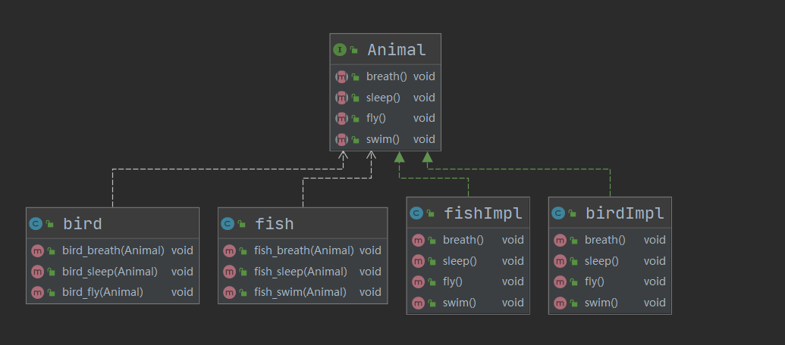
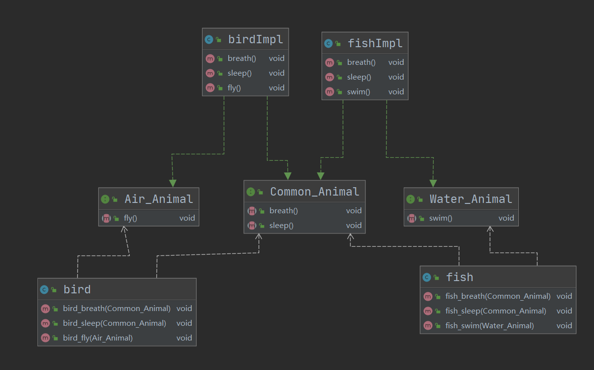

# 设计模式 六大原则


## 单一职责原则

**单一功能原则**（Single responsibility principle）规定每个类都应该有一个单一的功能，并且该功能应该由这个类完全封装起来。所有它的（这个类的）服务都应该严密的和该功能平行（功能平行，意味着没有依赖）。

Robert Cecil Martin 功能（职责）定义为：“改变的原因”，并且总结出一个类或者模块应该有且只有一个改变的原因。

> 想象有一个用于编辑和打印报表的模块。这样的一个模块存在两个改变的原因。第一，报表的内容可以改变（编辑）。第二，报表的格式可以改变（打印）。这两方面会的改变因为完全不同的起因而发生：一个是本质的修改，一个是表面的修改。单一功能原则认为这两方面的问题事实上是两个分离的功能，因此他们应该分离在不同的类或者模块里。

例如，我们定义 `Vehicle` 类

```java
class Vehicle{
    public void run(String name){
        System.out.println(name+"在公路上跑");
        // System.out.println(name+"在道路上跑");
    }
}

public static void main(){
    Vehicle vehicle = new Vehicle();
    vehicle.run("汽车");
    vehicle.run("飞机");
}
```

这里就违反了单一职责原则。因为这个类同时**实现了汽车与飞机的运行职责**。换言之，交通工具的本质（汽车还是飞机），以及交通工具的运行方式（在公路上还是道路上）这两种改变原因都可以在该类中发生。

严格按照 SRP 原则的代码如下：

```java
class RoadVehicle{
    public void run(String name){
        System.out.println(name+"在公路上跑");
        // System.out.println(name+"在道路上跑");
    }
}

class AirVehicle{
    public void run(String name){
        System.out.println(name+"在天上飞");
        // System.out.println(name+"在空中飘");
    }
}

public static void main(){
    Vehicle vehicle = new Vehicle();
    AirVehicle airVehicle = new AirVehicle();
    vehicle.run("汽车");
    airVehicle.run("飞机");
}
```

在这个代码中，各交通工具类就只能改变交通工具的运行方式（公路/道路，飞/飘）。而不能改变交通工具的本质，AirVehicle 就只能是在上天的交通工具（虽然我们没有进行什么检测，但逻辑上是这样的）。

严格按照 SRP 原则的代码有一个问题：开销往往过大。如果我们想再加上：水中游的/地里挖的/星际穿梭的/... 那么就必须写很多类。因此一般是采用如下的折中处理：

```java
class Vehicle{
    public void runRoad(String name){
        System.out.println(name+"在公路上跑");
        // System.out.println(name+"在道路上跑");
    }
    
    public void runAir(String name){
        System.out.println(name+"在天上飞");
        // System.out.println(name+"在空中飘");
    }
}

public static void main(){
    Vehicle vehicle = new Vehicle();
    vehicle.runRoad("汽车");
    vehicle.runAir("飞机");
}
```

严格意义上来说，我们并没有实现 SRP。但这种这种做法是工程中可取的。实际上，这种方法相当于 **方法级别的SRP**。

请注意：方法级别的 SRP 并不代表可以在一个方法中加入很多 `if..else..`，将交通工具的本质移动到内部处理虽然解决了问题，但是该方法仍然承担了两个职责（本质/方式）。恰恰相反，SRP强调的是尽量减少`if..else..`，而是尽可能多地设置类/方法，并在不同情况（不同本质）下调用对应的类/方法。

例如下面的正确代码中，Vehicle 类的两个方法只承担了运行方式的改变。而交通工具本质的改变被移动到了 main() 函数中处理。

```java
// Wrong!
public void run(String name){
	if(isRoadVehicle(name)){
        System.out.println(name+"在公路上跑");
        // System.out.println(name+"在道路上跑");
	} else {
        if(isAirVehicle(name)){
        	System.out.println(name+"在天上飞");
        	// System.out.println(name+"在空中飘");
        }
    }
}

// Yes!
class Vehicle{
    public void runRoad(String name){
        System.out.println(name+"在公路上跑");
        // System.out.println(name+"在道路上跑");
    }
    
    public void runAir(String name){
        System.out.println(name+"在天上飞");
        // System.out.println(name+"在空中飘");
    }
}

public static void main(){
    Vehicle vehicle = new Vehicle();
    String name1 = "汽车";
    String name2 = "飞机";
    if(isRoadVehicle(name1)){
        vehicle.runRoad(name1);
	} else {
        if(isAirVehicle(name2)){
            vehicle.runAir(name2);
        }
    }
}
```


1. 降低类的复杂度，保证每个类的负责事务单一
2. 提高类的可读性与可维护性
3. 提高代码的健壮性，降低因为代码变更带来的风险
4. 在逻辑足够简单的情况下，可以代码级别地违反该原则


## 接口隔离原则

**接口隔离原则**（英语：interface-segregation principles， 缩写：ISP）客户端不应依赖它不需要的接口。类间的依赖关系应该建立在最小的接口上。

如果一个接口在实现时，部分方法由于冗余被客户端空实现，则应该将接口拆分，让实现类只需依赖自己需要的接口方法。换言之，不要把一大堆方法塞进一个接口里，导致这个接口变得臃肿无比。应该要根据实际需要，让接口中只有用得上的方法，也就是说要细化我们的接口。

有观众就要问了，你说这些是森莫意思？我们来拿例子来说明。

考虑我们要实现鱼和鸟这两个类，它们共有的方法是`breath()`和`sleep()`，特有的方法分别是`swim()`和`fly()`。根据依赖倒转原则，我们使用接口。

错误的实现方式如下：



我们直接使用一个 Animal 接口完成了这四个方法，而实现这个接口的两个实现类则必须要实现其不需要的方法。（例如 `fishImpl` 中的 `fly()`）

在实体类中的使用时，我们只需要传入 Animal ，即可实现每个实体类所需要的三个方法。但是，在实体类中我们同样可以使用不被需要的第四个方法，这被称作接口污染。整体代码如下：

```java
/**
 * Animal
 */
public interface Animal {
    public void breath();
    public void sleep();
    public void fly();
    public void swim();
}

/**
 * BirdImpl
 */
 public class birdImpl implements Animal{
    @Override
    public void breath() {
        System.out.println("bird - breath");
    }
    @Override
    public void sleep() {
        System.out.println("bird - sleep");
    }
    @Override
    public void fly() {
        System.out.println("bird - fly");

    }
    @Override
    public void swim() {
        System.out.println("bird - swim");
    }
}

/**
 * FishImpl
 */
public class fishImpl implements Animal{
    @Override
    public void breath() {
        System.out.println("fish - breath");
    }
    @Override
    public void sleep() {
        System.out.println("fish - sleep");
    }
    @Override
    public void fly() {
        System.out.println("fish - fly");
    }
    @Override
    public void swim() {
        System.out.println("fish - swim");
    }
}
    

/**
 * Bird
 */
public class bird {
    public void bird_breath(Animal animal){
        animal.breath();
    }
    public void bird_sleep(Animal animal){
        animal.sleep();
    }
    public void bird_fly(Animal animal){
        animal.fly();
    }
}

/**
 * Fish
 */
public class fish {
    public void fish_breath(Animal animal){
        animal.breath();
    }
    public void fish_sleep(Animal animal){
        animal.sleep();
    }
    public void fish_swim(Animal animal){
        animal.swim();
    }
}
```


正确的实现方法应该是这样的：



我们将原来的 Animal 接口拆分成三个接口，如果这个实现类需要接口中的所有方法，那么我们才去实现它。实体类中不会出现冗余的不被需要的方法。这样就保证它们的依赖关系建立在最小的接口上。

 

```java
public interface Common_Animal {
    public void breath();
    public void sleep();
}

public interface Air_Animal {
    public void fly();
}

public interface Water_Animal {
    public void swim();
}

public class birdImpl
        implements Air_Animal, Common_Animal {
    @Override
    ......
}

public class fishImpl
        implements Water_Animal,Common_Animal {
    @Override
    ......
}

public class bird {
    public void bird_breath(Common_Animal common_animal){
        common_animal.breath();
    }
    public void bird_sleep(Common_Animal common_animal){
        common_animal.sleep();
    }
    public void bird_fly(Air_Animal air_animal){
        air_animal.fly();
    }
}

public class fish {
    public void fish_breath(Common_Animal common_animal){
        common_animal.breath();
    }
    public void fish_sleep(Common_Animal common_animal){
        common_animal.sleep();
    }
    public void fish_swim(Water_Animal waterAnimal){
        waterAnimal.swim();
    }
}
```

接口隔离原则和单一职责原则非常类似。单一职责原则要求接口的职责是单一的，而接口隔离原则要求接口尽量细化，它们有异曲同工之妙，都是要让我们的接口功能尽量单一，尽量小。

但是，单一职责原则的着重点是在“职责”，而接口隔离原则只单纯地要求接口最小化。那么，如果已经满足单一职责原则的接口，在当前的需求下还可以继续细化，那么还需要细化吗？答案是不要再细化了。在实践中，接口设计的粒度越小，系统就越灵活，这是事实。但是灵活的同时也带来了系统的复杂化，导致开发难度增加。所以接口并不是越小越好，必须要有一个度。当单一职责原则和接口隔离原则存在矛盾时，以满足单一职责原则为底线。

以上这段来自 [简书](https://zh.wikipedia.org/wiki/%E5%8D%95%E4%B8%80%E5%8A%9F%E8%83%BD%E5%8E%9F%E5%88%99) 。


## 依赖反转原则

**依赖反转原则**（Dependency inversion principle，DIP）是指一种特定的解耦（传统的依赖关系建立在高层次上，而具体的策略设置则应用在低层次的模块上）形式，使得高层次的模块不依赖于低层次的模块的实现细节，依赖关系被颠倒（反转），从而使得低层次模块依赖于高层次模块的需求抽象。

该原则规定：

1. 高层次的模块不应该依赖于低层次的模块，两者都应该依赖于抽象接口。
2. 抽象接口不应该依赖于具体实现。而具体实现则应该依赖于抽象接口。

这是什么意思呢？下面是一个错误示范：

```java
class Email{
    public String getInfo(){
        return "Email:hello";
    }
}

class Receiver{
    public void receive(Email email){
        System.out.println(email.getInfo());
    }
}
```

不难看出，代码中 Email 是底层类，Receiver 是高层类。但是这里的高层类却完全依赖于底层类的实现。此处的 `receive()` 方法需要传入一个具体的底层类。

这有什么问题吗？高层类总要或多或少地知道底层类的东西啊！注意，知道 != 依赖。这里的方法**完全依赖于** Email 实体类。如果是电话、短信、微信，这个 `receive()`方法直接被废掉了。这就是所谓的<u>高层次的模块不应该依赖于低层次的模块</u>。

正确的做法如下：

```java
interface Message{
    public String getInfo();
}

class Email implements Message{
    public String getInfo(){
        return "Email:hello";
    }
}
class Wechat implements Message{
    public String getInfo(){
        return "Wechat:hello";
    }
}

class Receiver{
    public void receive(Message msg){
        System.out.println(msg.getInfo());
    }
}
```

可以看到，在这个例子里：

1. Receiver 类不再依赖 Email 类，而是依赖 Message 接口
2. Email、Wechat 类不再是自顾自地实现，而是依赖 Message 接口的规范
3. 在逻辑上，先定义好了  Message 接口，才能以此为规范实现具体的类。（无论是上层类还是下层类）这就是所谓的 <u>抽象接口不应该依赖于具体实现。而具体实现则应该依赖于抽象接口</u>。
4. 在这里，接收者依旧知道传入的信息中有 `getInfo()`,但是它并不用关心这个方法是被谁实现、怎样实现的。知道，但不依赖。

小结

1. 依赖倒转（倒置）的中心思想是**面向接口编程**
2. 依赖倒转原则是基于这样的设计理念：相对于细节的多变性，抽象的东西要稳定的多。以抽象为基础搭建的架构比以细节为基础的架构要稳定的多。在jaνa中，抽象指的是接口或抽象类，细节就是具体的实现类
3. 使用接口或抽象类的目的是制定好规范，而不涉及任何具体的操作，把展现细节的任务交给他们的实现类去完成

> 多逼逼两句：
>
> 就像前后端分离一样，应该是先制定出前后端的交互接口，然后在基于接口文档分别开发。前后端彼此并不需要操心对方如何实现，只需要将封装好的接口拿过来用即可。而不是直接调用后端的代码

## 里氏替换原则

**里氏替换原则**（Liskov Substitution principle）是对子类型的特别定义。内容可以描述为： “派生类（子类）对象可以在程式中代替其基类（超类）对象。”

> 我们先来回忆一下知识点：
>
> 继承：
>
> 子类继承父类，父类派生子类。父类中的所有属性方法都被子类继承了（尽管声明为 private 的无法被子类访问，但是它们也被继承了）。子类可以对父类的方法进行 重写（override）
>
> 多态：
>
> 如果子类继承了父类，并且子类重写了父类的方法，并且有父类引用指向子类对象（`Parent p = new Child()`）那么，当我们调用 `p` 的某方法时，实际运行的是被子类重写后的该方法。

也就是说，我们希望所有用到父类的地方，都可以将其换为子类。并且程序还能继续运行。

也就是说，尽量不要让子类重写父类方法，**可以拓展，不要修改**。

*对了，对于抽象类的，我们称之为实现，而非重写。*


```java
class Parent {
    public void hello() {
        System.out.println("Hello my dear friend!");
    }
}

// 错误示范，重写了父类方法
class Son extends Parent {
    @Override
    public void hello() {
        System.out.println("YOU A Son of Bitch!");
    }
}

// 正确示范， 只拓展不修改
class Daughter extends Parent{
    public void myHello(){
        System.out.println("Hello,uncle!");
    }
}

```

继承实际上让两个类之间的耦合性增强了。如果我们非要重写这个方法呢？那么可以通过聚合、组合、依赖来解决问题。

组合：

```java
class Parent {
    public void hello() {
        System.out.println("Hello my dear friend!");
    }
}

class Son {
    private Parent parent;
    public void hello(){
        parent.hello();
    }
}

```

为了保证这一原则，我们在 Java 中可以对父类的、不想被改变的方法加上 `final` 修饰符

```java
class Parent {
    public final void hello() {
        System.out.println("Hello my dear friend!");
    }
}

class Son extends Parent {
    @Override
    public void hello() {       //  报错: overridden method is final! 
        System.out.println("YOU A Son of Bitch!");
    }
}

```


## 迪米特法则

**得墨忒耳定律**（**Law of Demeter**，缩写**LoD**）亦被称作“最少知识原则（Principle of Least Knowledge）”

1. 每个单元对于其他的单元只能拥有有限的知识：只是与当前单元紧密联系的单元；
2. 每个单元只能和它的朋友交谈：不能和陌生单元交谈；
3. 只和自己直接的朋友交谈。

这个原理的名称来源于希腊神话中的农业女神，孤独的得墨忒耳。

一个类对自己依赖的类知道的越少越好。对于被依赖的类不管多么复杂，都尽量将逻辑封装在类的内部。对外除了提供的 public方法，不对外泄露任何信息。

迪米特法则还有个更简单的定义：只与直接的朋友通信

直接的朋友：每个对象都会与其他对象有耦贪关系，只要两个对象之间有耦合关系我们就说这两个对象之间是朋友关系。耦合的方式很多，依赖，关联，组合，聚合等。其中，我们称出现成员变量，方法参数，方法返回值中的类为直接的朋友，而出现在局部变量中的类不是直接的朋友。也就是说，陌生的类最好不要以局部变量的形式出现在类的内部。

```java
class Parent {
    public void hello() {
        System.out.println("Hello my dear friend!");
    }
}

// 正确：成员变量parent是直接朋友
class Son {
    private Parent parent;
    public void hello(){
        parent.hello();
    }
}

// 错误：在这里，局部变量parent是个陌生类
class Son {
    public void hello(){
    	Parent parent;
        parent.hello();
    }
}

```

再来个例子：

```java
// 错误
class Message{
    // ...这里就不实现了
}


class Email{
    private Message msg = "hello,email";
    public Message getMsg(){
        return msg;
    }
}

class Receiver{
    public void printAllMessage(Email email){
        Message msg = email.getMsg();
        System.out.println(msg);
    }
}

```

这是错误示范。

在 `Receiver` 的 `printAllMessage` 方法中。引入了一个陌生类 `Message`,它不是成员变量，方法参数，方法返回值。

当然这里直接传入Email类也不符合依赖反转原则。这里就不细究了。

正确示范如下：

```java
class Email{
    private Message msg = "hello,email";
    public Message getMsg(){
        return msg;
    }
    public void printMsg(){
        System.out.println(msg);
    }
}

class Receiver{
    public void printAllInfo(Email email){
        email.printMsg();
    }
}

```

这样，我们就规避掉了Message在Receiver类中的出现。

小结

1. 迪米特法则降低了类与类之间的耦合（不出现陌生类）
2. 但并不意味着完全消除类之间的依赖关系，只是尽量降低。（允许出现直接朋友）
3. 

## 开闭原则

**开闭原则**规定“*软件中的对象（类，模块，函数等等）应该对于扩展是开放的，但是对于修改是封闭的*”，这意味着一个实体是允许在不改变它的源代码的前提下变更它的行为

说实话我完全没搞懂这个原则是什么意思。表述的太过模糊了。我只能从他人的表述/笔记中知道：这一原则是整个设计模式的核心原则，或者说其他的原则、设计模式都是以满足这个原则为目的的，或者说，如果项目能够满足其他原则/模式，那么自然也就满足了开闭原则。


## 合成复用原则

原则是尽量使用合成/聚合的方式，而不是使用继承。

```java
class A {
    public void func1(){}
    public void func2(){}
}

class B1 extends A{
    // 继承,B1拥有A的所有方法
    // 但是这种耦合性太强
}

class B2{
    // 依赖
    public void func1B(A a){
        a.func1();
    }
}

class B3{
    // 聚合
    private A a;

    public void setA(A a) {
        this.a = a;
    }

    public void func1B(){
        a.func1();
    }
}

class B4{
    //组合
    private A a = new A();
    public void func1B(){
        a.func1();
    }
}

```

依赖：

类B使用到了另一个类A，而这种使用关系是具有偶然性的、临时性的、非常弱的，但是A类的变化会影响到B。表现为：A作为参数被B方法调用

聚合：

体现的是整体与部分、拥有的关系，即has-a的关系，此时整体与部分之间是可分离的，他们可以具有各自的生命周期，部分可以属于多个整体对象，也可以为多个整体对象共享。表现为：A作为B的类属性。

组合：

体现的是一种contains-a的关系，这种关系比聚合更强，也称为强聚合；他同样体现整体与部分间的关系，但此时整体与部分是不可分的，整体的生命周期结束也就意味着部分的生命周期结束；比如你和你的大脑。表现为：A作为B的类属性。

参见参考资料。


## 后记

这一份笔记写的极为痛苦。所有的原则都没有难理解的地方。但总觉得如同隔靴搔痒，既不能完全理解原则，也反复意识到自己原来的代码中的各种问题，还会在转瞬之间想“卧槽这种情况改怎么改才能符合原则？根本没法改啊！” 只能寄托于假设自己学的还不到位，等学完23种设计模式，在加上大量的工程项目，再经常回顾思考，或许能理解的更加深入一些。思而不学则殆。

## 参考资料

维基百科

> 1. [单一功能原则](https://zh.wikipedia.org/wiki/%E5%8D%95%E4%B8%80%E5%8A%9F%E8%83%BD%E5%8E%9F%E5%88%99)
> 2. [接口隔离原则](https://zh.wikipedia.org/zh-cn/%E6%8E%A5%E5%8F%A3%E9%9A%94%E7%A6%BB%E5%8E%9F%E5%88%99#cite_note-ASD-1)
> 3. [依赖反转原则](https://zh.wikipedia.org/wiki/%E4%BE%9D%E8%B5%96%E5%8F%8D%E8%BD%AC%E5%8E%9F%E5%88%99)
> 4. [里氏替换原则](https://zh.wikipedia.org/wiki/%E9%87%8C%E6%B0%8F%E6%9B%BF%E6%8D%A2%E5%8E%9F%E5%88%99)
> 5. [开闭原则](https://zh.wikipedia.org/wiki/%E5%BC%80%E9%97%AD%E5%8E%9F%E5%88%99)

[尚硅谷Java设计模式](https://www.bilibili.com/video/BV1G4411c7N4?p=5)

[继承、实现、依赖、关联、聚合、组合的联系与区别](https://www.jianshu.com/p/fe949c2f081a)